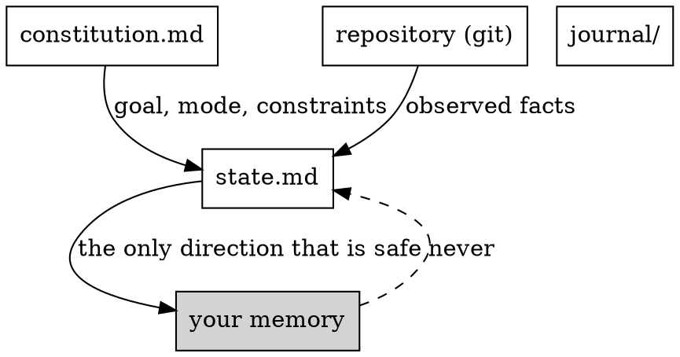
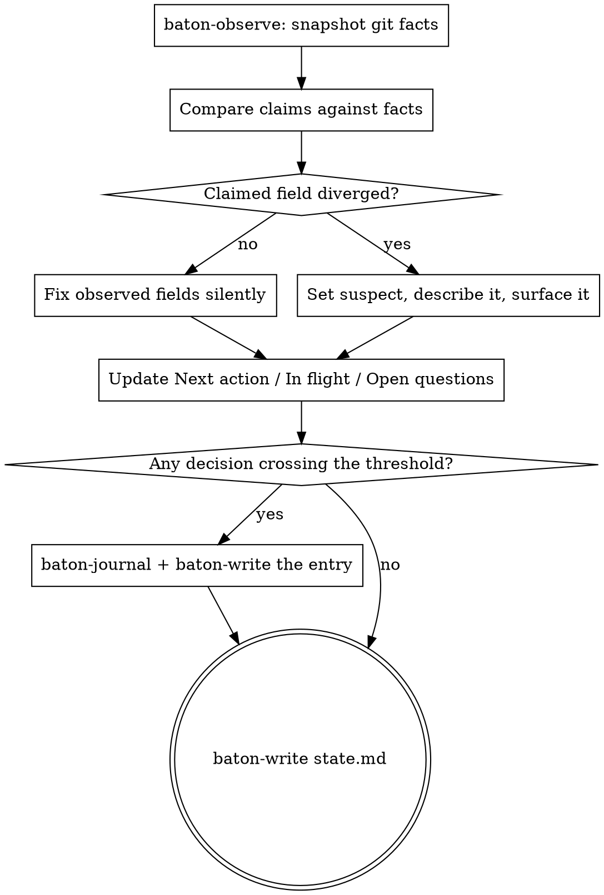
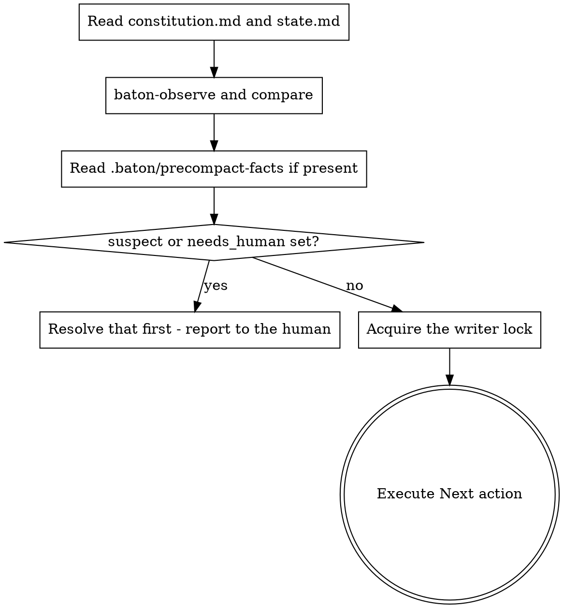

# baton Core Implementation Plan

> **For agentic workers:** REQUIRED SUB-SKILL: Use superpowers:subagent-driven-development (recommended) or superpowers:executing-plans to implement this plan task-by-task. Steps use checkbox (`- [ ]`) syntax for tracking.

**Goal:** Ship the baton plugin core — durable run state, checkpoint, resume, journal and lock — so an agent that wakes up after context compaction restores "where we are, who I am, what's next" in one step.

**Architecture:** A Claude Code plugin distributed through its own marketplace. Prose (skills and commands) carries procedure and judgement; four small POSIX-ish bash scripts carry the mechanics that must be repeatable and repository-agnostic — git facts, atomic write, lock, journal numbering. Everything project-specific comes from the ratified constitution, never from the scripts. Two hooks make resume automatic without touching any of the user's files. State lives in `docs/baton/`, committed, and git history is the event log.

**Tech Stack:** bash, git, sed/grep/awk, shasum. No runtime dependencies beyond those. Tests are plain bash with assert helpers, modelled on `superpowers/tests/codex-plugin-sync/`.

**Spec:** `docs/superpowers/specs/2026-08-03-baton-orchestration-plugin-design.md`

**Scope:** This plan covers sections 6.1–6.3, 7.1–7.4 (minus `baton-verify`), 8.1–8.4, 8.6–8.7 and tests 1, 4, 5, 6, 7, 9 of the spec. The gate — `baton-gate` skill, `baton-verify` script, `docs/baton/gates/`, tests 2 and 3 — is a separate plan and depends on this one.

**Deviation from the spec, deliberate:** the spec lists four scripts. This plan adds a fifth, `baton-journal`, which allocates the next journal id. Both the agent and `baton-lock` (for `takeover` entries) need that number, and duplicating the logic in two places is how the two get out of step. It is nine lines.

---

## File Structure

| File | Responsibility |
|---|---|
| `.claude-plugin/marketplace.json` | Marketplace listing baton and superpowers |
| `plugins/baton/.claude-plugin/plugin.json` | Plugin manifest |
| `plugins/baton/scripts/baton-observe` | Print git facts as `key=value`; list files changed since a SHA |
| `plugins/baton/scripts/baton-lock` | Acquire / check / release / take over the writer role |
| `plugins/baton/scripts/baton-write` | Atomic write from stdin, then commit; decline to write when nothing changed |
| `plugins/baton/scripts/baton-journal` | Allocate the next journal id and path |
| `plugins/baton/hooks/hooks.json` | Register PreCompact and SessionStart |
| `plugins/baton/hooks/pre-compact` | Snapshot git facts to `.baton/precompact-facts`, warn |
| `plugins/baton/hooks/session-start` | Inject resume instruction plus the key state lines |
| `plugins/baton/skills/baton/SKILL.md` | The model: what is authoritative, what is derived, why |
| `plugins/baton/skills/baton-checkpoint/SKILL.md` | When and how to persist |
| `plugins/baton/skills/baton-resume/SKILL.md` | Recovery after context reset |
| `plugins/baton/commands/init.md` | Human: decomposition dialogue, writes the constitution |
| `plugins/baton/commands/checkpoint.md` | Human: persist before a manual compact |
| `plugins/baton/commands/status.md` | Human: deviations-first summary |
| `plugins/baton/templates/constitution.md` | Constitution skeleton |
| `plugins/baton/templates/state.md` | State skeleton |
| `tests/helpers.sh` | assert_* helpers and git fixture builder |
| `tests/test-observe.sh` … `tests/test-invariant.sh` | One file per unit under test |
| `tests/run-tests` | Runs every `test-*.sh`, non-zero on any failure |

All plugin-facing content is written in **English** — the plugin is public. This plan and the spec are in Russian.

---

### Task 1: Repository skeleton and test harness

**Files:**
- Create: `.gitignore`
- Create: `.claude-plugin/marketplace.json`
- Create: `plugins/baton/.claude-plugin/plugin.json`
- Create: `tests/helpers.sh`
- Create: `tests/run-tests`
- Create: `tests/test-manifests.sh`

- [ ] **Step 1: Write the failing test**

Create `tests/test-manifests.sh`:

```bash
#!/usr/bin/env bash
set -euo pipefail
SCRIPT_DIR="$(cd "$(dirname "$0")" && pwd)"
REPO_ROOT="$(cd "$SCRIPT_DIR/.." && pwd)"
. "$SCRIPT_DIR/helpers.sh"

MARKETPLACE="$REPO_ROOT/.claude-plugin/marketplace.json"
PLUGIN="$REPO_ROOT/plugins/baton/.claude-plugin/plugin.json"

assert_file_exists "$MARKETPLACE" "marketplace.json exists"
assert_file_exists "$PLUGIN" "plugin.json exists"

assert_valid_json "$MARKETPLACE" "marketplace.json is valid JSON"
assert_valid_json "$PLUGIN" "plugin.json is valid JSON"

assert_equals "$(json_get "$PLUGIN" name)" "baton" "plugin is named baton"
assert_contains "$(cat "$MARKETPLACE")" '"./plugins/baton"' "marketplace points at the local plugin"
assert_contains "$(cat "$MARKETPLACE")" 'obra/superpowers' "marketplace lists superpowers as the companion"

finish
```

- [ ] **Step 2: Write the helpers the test needs**

Create `tests/helpers.sh`:

```bash
#!/usr/bin/env bash
# Assert helpers shared by every baton test file.

FAILURES=0

pass() { echo "  [PASS] $1"; }

fail() {
    echo "  [FAIL] $1"
    FAILURES=$((FAILURES + 1))
}

assert_equals() {
    if [ "$1" = "$2" ]; then
        pass "$3"
    else
        fail "$3"
        echo "    expected: $2"
        echo "    actual:   $1"
    fi
}

assert_contains() {
    if printf '%s' "$1" | grep -Fq -- "$2"; then
        pass "$3"
    else
        fail "$3"
        echo "    expected to find: $2"
    fi
}

assert_not_contains() {
    if printf '%s' "$1" | grep -Fq -- "$2"; then
        fail "$3"
        echo "    did not expect to find: $2"
    else
        pass "$3"
    fi
}

assert_file_exists() {
    if [ -f "$1" ]; then pass "$2"; else fail "$2"; echo "    missing: $1"; fi
}

assert_exit_code() {
    # assert_exit_code <expected> <description> <command...>
    local expected="$1" description="$2"; shift 2
    local actual=0
    "$@" >/dev/null 2>&1 || actual=$?
    assert_equals "$actual" "$expected" "$description"
}

assert_valid_json() {
    if python3 -c "import json,sys; json.load(open(sys.argv[1]))" "$1" 2>/dev/null; then
        pass "$2"
    else
        fail "$2"
    fi
}

json_get() {
    python3 -c "import json,sys; print(json.load(open(sys.argv[1])).get(sys.argv[2], ''))" "$1" "$2"
}

# Create a throwaway git repository and cd into it. Sets $FIXTURE.
make_fixture_repo() {
    FIXTURE="$(mktemp -d)"
    cd "$FIXTURE"
    git init -q
    git config user.name "baton test"
    git config user.email "baton@example.invalid"
    git config commit.gpgsign false
    echo "seed" > seed.txt
    git add seed.txt
    git commit -q -m "seed"
}

cleanup_fixture() {
    [ -n "${FIXTURE:-}" ] && [ -d "$FIXTURE" ] && rm -rf "$FIXTURE"
    return 0
}

finish() {
    cleanup_fixture
    if [ "$FAILURES" -gt 0 ]; then
        echo "  $FAILURES assertion(s) failed"
        exit 1
    fi
    exit 0
}
```

`python3` is used only by the test harness for JSON parsing, never by the plugin at runtime. The spec's dependency list constrains the shipped scripts, not the test rig.

- [ ] **Step 3: Write the runner**

Create `tests/run-tests`:

```bash
#!/usr/bin/env bash
set -uo pipefail
SCRIPT_DIR="$(cd "$(dirname "$0")" && pwd)"

failed=0
for t in "$SCRIPT_DIR"/test-*.sh; do
    echo "== $(basename "$t")"
    if ! bash "$t"; then
        failed=$((failed + 1))
    fi
done

if [ "$failed" -gt 0 ]; then
    echo "FAILED: $failed test file(s)"
    exit 1
fi
echo "All test files passed."
```

Make both executable:

```bash
chmod +x tests/run-tests
```

- [ ] **Step 4: Run the test to verify it fails**

Run: `bash tests/test-manifests.sh`
Expected: FAIL — `marketplace.json exists` and `plugin.json exists` both report missing files.

- [ ] **Step 5: Write the manifests**

Create `.claude-plugin/marketplace.json`:

```json
{
  "name": "baton",
  "description": "Keeps goal and state coherent across multi-day autonomous agent runs",
  "owner": {
    "name": "Artem Kononov",
    "email": "artemkononov2000@gmail.com"
  },
  "plugins": [
    {
      "name": "baton",
      "description": "Durable run state, checkpoint, resume and decision journal for multi-day autonomous sessions",
      "version": "0.1.0",
      "source": "./plugins/baton"
    },
    {
      "name": "superpowers",
      "description": "Companion plugin baton composes with: specs, plans, TDD, subagent-driven development",
      "source": {
        "source": "url",
        "url": "https://github.com/obra/superpowers.git"
      }
    }
  ]
}
```

Create `plugins/baton/.claude-plugin/plugin.json`:

```json
{
  "name": "baton",
  "description": "Keeps goal and state coherent across multi-day autonomous runs: durable state, one-command checkpoint, verified resume after context compaction, and an append-only decision journal",
  "version": "0.1.0",
  "author": {
    "name": "Artem Kononov",
    "email": "artemkononov2000@gmail.com"
  },
  "homepage": "https://github.com/artemkononov/baton",
  "license": "MIT",
  "keywords": [
    "long-running",
    "autonomous",
    "state",
    "checkpoint",
    "compaction",
    "orchestration"
  ]
}
```

Create `.gitignore`:

```
.baton/
```

- [ ] **Step 6: Run the test to verify it passes**

Run: `bash tests/test-manifests.sh`
Expected: PASS on all six assertions.

- [ ] **Step 7: Commit**

```bash
git add .gitignore .claude-plugin plugins/baton/.claude-plugin tests
git commit -m "feat: repository skeleton, manifests and bash test harness"
```

---

### Task 2: `baton-observe`

Prints repository facts. Knows nothing about any project — only git.

**Files:**
- Create: `plugins/baton/scripts/baton-observe`
- Create: `tests/test-observe.sh`

- [ ] **Step 1: Write the failing test**

Create `tests/test-observe.sh`:

```bash
#!/usr/bin/env bash
set -euo pipefail
SCRIPT_DIR="$(cd "$(dirname "$0")" && pwd)"
REPO_ROOT="$(cd "$SCRIPT_DIR/.." && pwd)"
OBSERVE="$REPO_ROOT/plugins/baton/scripts/baton-observe"
. "$SCRIPT_DIR/helpers.sh"

make_fixture_repo

out="$("$OBSERVE")"
expected_sha="$(git rev-parse HEAD)"

assert_contains "$out" "sha=$expected_sha" "reports the current SHA"
assert_contains "$out" "tree_clean=true" "reports a clean tree as clean"
assert_contains "$out" "dirty_count=0" "counts zero dirty paths on a clean tree"

branch="$(git symbolic-ref --short HEAD)"
assert_contains "$out" "branch=$branch" "reports the current branch"

echo "scratch" > untracked.txt
out="$("$OBSERVE")"
assert_contains "$out" "tree_clean=false" "reports a dirty tree as dirty"
assert_contains "$out" "dirty_count=1" "counts one dirty path"

base="$(git rev-parse HEAD)"
git add untracked.txt
git commit -q -m "add untracked"
echo "more" > second.txt
git add second.txt
git commit -q -m "add second"

changed="$("$OBSERVE" --changed-since "$base")"
assert_contains "$changed" "untracked.txt" "lists a file changed since the given SHA"
assert_contains "$changed" "second.txt" "lists every file changed since the given SHA"
assert_not_contains "$changed" "seed.txt" "omits files untouched since the given SHA"

outside="$(mktemp -d)"
cd "$outside"
assert_exit_code 1 "exits 1 outside a git repository" "$OBSERVE"
cd /
rm -rf "$outside"

finish
```

- [ ] **Step 2: Run the test to verify it fails**

Run: `bash tests/test-observe.sh`
Expected: FAIL — the script does not exist, so every assertion errors.

- [ ] **Step 3: Write the script**

Create `plugins/baton/scripts/baton-observe`:

```bash
#!/usr/bin/env bash
# Print repository facts as key=value, or list files changed since a SHA.
# Knows nothing about any particular project: git only.
set -euo pipefail

usage() {
    echo "usage: baton-observe [--changed-since <SHA>]" >&2
    exit 64
}

changed_since=""
while [ $# -gt 0 ]; do
    case "$1" in
        --changed-since)
            [ $# -ge 2 ] || usage
            changed_since="$2"
            shift 2
            ;;
        -h|--help) usage ;;
        *) usage ;;
    esac
done

if ! git rev-parse --git-dir >/dev/null 2>&1; then
    echo "baton-observe: not a git repository" >&2
    exit 1
fi

if [ -n "$changed_since" ]; then
    git diff --name-only "$changed_since"
    exit 0
fi

if git rev-parse --verify -q HEAD >/dev/null 2>&1; then
    sha="$(git rev-parse HEAD)"
    short_sha="$(git rev-parse --short HEAD)"
else
    sha=""
    short_sha=""
fi

branch="$(git symbolic-ref --short -q HEAD || echo '(detached)')"
dirty_count="$(git status --porcelain | wc -l | tr -d ' ')"

if [ "$dirty_count" = "0" ]; then
    tree_clean=true
else
    tree_clean=false
fi

printf 'sha=%s\n' "$sha"
printf 'short_sha=%s\n' "$short_sha"
printf 'branch=%s\n' "$branch"
printf 'tree_clean=%s\n' "$tree_clean"
printf 'dirty_count=%s\n' "$dirty_count"
```

```bash
chmod +x plugins/baton/scripts/baton-observe
```

- [ ] **Step 4: Run the test to verify it passes**

Run: `bash tests/test-observe.sh`
Expected: PASS on all nine assertions.

- [ ] **Step 5: Commit**

```bash
git add plugins/baton/scripts/baton-observe tests/test-observe.sh
git commit -m "feat: baton-observe prints repository facts"
```

---

### Task 3: `baton-lock`

The writer role is held for the whole session, not borrowed per write.

> **Superseded during implementation, 2026-08-03.** The code below was built as
> written, reviewed, and then reworked. Its pid-liveness check does not work:
> every Bash tool call in Claude Code is a fresh short-lived process, so the
> recorded `$PPID` is dead by the next call, `live` is unreachable, and every
> session takes over every other session's lock believing it abandoned.
>
> Liveness cannot be observed from inside a tool call, so the lock became a
> **lease**: the holder is live until the lease expires and refreshes it at each
> checkpoint. `stale` was renamed `expired`, since that is what is actually
> known. A fourth verb, `takeover`, always succeeds and names whom it displaced,
> so a crashed session can never strand a run for six hours. The pid is still
> recorded for a human debugging a wedged run, but no decision reads it.
>
> The shipped script and tests are the source of truth. The blocks below are
> kept as the record of what was tried and why it was abandoned. See the
> amendment in section 8.4 of the spec.

**Files:**
- Create: `plugins/baton/scripts/baton-lock`
- Create: `tests/test-lock.sh`

- [ ] **Step 1: Write the failing test**

Create `tests/test-lock.sh`:

```bash
#!/usr/bin/env bash
set -euo pipefail
SCRIPT_DIR="$(cd "$(dirname "$0")" && pwd)"
REPO_ROOT="$(cd "$SCRIPT_DIR/.." && pwd)"
LOCK="$REPO_ROOT/plugins/baton/scripts/baton-lock"
. "$SCRIPT_DIR/helpers.sh"

make_fixture_repo

assert_exit_code 0 "acquires a free lock" "$LOCK" acquire session-a
assert_file_exists ".baton/lock" "writes the lock file"
assert_exit_code 0 "acquiring our own lock again is a no-op" "$LOCK" acquire session-a
assert_exit_code 0 "check reports our own lock as held by us" "$LOCK" check session-a

# A different session, whose pid is this live test process, must be refused.
assert_exit_code 3 "refuses a lock held by another live session" "$LOCK" acquire session-b
assert_exit_code 3 "check reports another live session" "$LOCK" check session-b

assert_exit_code 3 "refuses to release a lock we do not hold" "$LOCK" release session-b
assert_exit_code 0 "releases our own lock" "$LOCK" release session-a
assert_exit_code 5 "check reports no lock once released" "$LOCK" check session-a

# A lock owned by a dead pid is stale and may be taken over.
mkdir -p .baton
cat > .baton/lock <<'EOF'
session=ghost
pid=99999999
acquired=2026-08-03T00:00:00Z
acquired_epoch=1785715200
EOF
assert_exit_code 4 "check reports a dead-pid lock as stale" "$LOCK" check session-c
takeover="$("$LOCK" acquire session-c)"
assert_contains "$takeover" "takeover=ghost" "reports whose stale lock was taken over"
assert_exit_code 0 "check reports our lock after takeover" "$LOCK" check session-c

# A lock older than six hours is stale even if its pid is alive.
cat > .baton/lock <<EOF
session=elder
pid=$$
acquired=2026-08-03T00:00:00Z
acquired_epoch=$(( $(date -u +%s) - 21601 ))
EOF
assert_exit_code 4 "check reports a six-hour-old lock as stale" "$LOCK" check session-d

finish
```

- [ ] **Step 2: Run the test to verify it fails**

Run: `bash tests/test-lock.sh`
Expected: FAIL — script missing.

- [ ] **Step 3: Write the script**

Create `plugins/baton/scripts/baton-lock`:

```bash
#!/usr/bin/env bash
# Hold, inspect, release or take over the baton writer role.
# The role is held for the whole session, not per write: two sessions taking
# turns to write would remove the race but not the divergence.
set -euo pipefail

STALE_SECONDS=21600   # six hours

LOCK_DIR=".baton"
LOCK_FILE="$LOCK_DIR/lock"

usage() {
    echo "usage: baton-lock {acquire|check|release} <session-id>" >&2
    exit 64
}

[ $# -eq 2 ] || usage
cmd="$1"
session="$2"

read_field() {
    sed -n "s/^$1=//p" "$LOCK_FILE" 2>/dev/null | head -1
}

# Prints one of: none | ours | live | stale
lock_state() {
    if [ ! -f "$LOCK_FILE" ]; then
        echo none
        return
    fi

    local owner pid acquired now
    owner="$(read_field session)"
    if [ "$owner" = "$session" ]; then
        echo ours
        return
    fi

    acquired="$(read_field acquired_epoch)"
    now="$(date -u +%s)"
    if [ -n "$acquired" ] && [ "$((now - acquired))" -ge "$STALE_SECONDS" ]; then
        echo stale
        return
    fi

    pid="$(read_field pid)"
    if [ -n "$pid" ] && kill -0 "$pid" 2>/dev/null; then
        echo live
    else
        echo stale
    fi
}

write_lock() {
    mkdir -p "$LOCK_DIR"
    local tmp="$LOCK_DIR/.lock.tmp.$$"
    {
        printf 'session=%s\n' "$session"
        printf 'pid=%s\n' "$PPID"
        printf 'acquired=%s\n' "$(date -u +%Y-%m-%dT%H:%M:%SZ)"
        printf 'acquired_epoch=%s\n' "$(date -u +%s)"
    } > "$tmp"
    mv "$tmp" "$LOCK_FILE"
}

state="$(lock_state)"

case "$cmd" in
    acquire)
        case "$state" in
            none|ours)
                write_lock
                ;;
            stale)
                previous="$(read_field session)"
                write_lock
                printf 'takeover=%s\n' "$previous"
                ;;
            live)
                echo "baton-lock: held by live session $(read_field session)" >&2
                exit 3
                ;;
        esac
        ;;
    check)
        case "$state" in
            ours)  exit 0 ;;
            live)  exit 3 ;;
            stale) exit 4 ;;
            none)  exit 5 ;;
        esac
        ;;
    release)
        case "$state" in
            ours) rm -f "$LOCK_FILE" ;;
            none) : ;;
            *)
                echo "baton-lock: refusing to release a lock we do not hold" >&2
                exit 3
                ;;
        esac
        ;;
    *) usage ;;
esac
```

`$PPID` is recorded rather than `$$` because the script's own pid dies the instant it exits; the caller is the process whose liveness matters.

```bash
chmod +x plugins/baton/scripts/baton-lock
```

- [ ] **Step 4: Run the test to verify it passes**

Run: `bash tests/test-lock.sh`
Expected: PASS on all twelve assertions.

- [ ] **Step 5: Commit**

```bash
git add plugins/baton/scripts/baton-lock tests/test-lock.sh
git commit -m "feat: baton-lock holds the writer role for the session"
```

---

### Task 4: `baton-write`

Atomic write plus commit. Declines to write when nothing changed, so state never lives outside the log.

**Files:**
- Create: `plugins/baton/scripts/baton-write`
- Create: `tests/test-write.sh`

- [ ] **Step 1: Write the failing test**

Create `tests/test-write.sh`:

```bash
#!/usr/bin/env bash
set -euo pipefail
SCRIPT_DIR="$(cd "$(dirname "$0")" && pwd)"
REPO_ROOT="$(cd "$SCRIPT_DIR/.." && pwd)"
WRITE="$REPO_ROOT/plugins/baton/scripts/baton-write"
. "$SCRIPT_DIR/helpers.sh"

make_fixture_repo

printf 'updated_at: 2026-08-03T10:00:00Z\nCurrent wave: 1\n' \
    | "$WRITE" -m "baton: first checkpoint" docs/baton/state.md

assert_file_exists "docs/baton/state.md" "creates the file and its parents"
assert_equals "$(git status --porcelain docs/baton | wc -l | tr -d ' ')" "0" \
    "leaves docs/baton clean, so no state exists outside the log"
assert_contains "$(git log -1 --pretty=%s)" "baton: first checkpoint" "uses the given commit message"

commits_before="$(git rev-list --count HEAD)"

# Same content, later timestamp: nothing of substance changed.
printf 'updated_at: 2026-08-03T11:00:00Z\nCurrent wave: 1\n' \
    | "$WRITE" -m "baton: idle checkpoint" docs/baton/state.md

assert_equals "$(git rev-list --count HEAD)" "$commits_before" "an idle checkpoint creates no commit"
assert_equals "$(git status --porcelain docs/baton | wc -l | tr -d ' ')" "0" \
    "an idle checkpoint leaves no dirty file behind"
assert_contains "$(cat docs/baton/state.md)" "2026-08-03T10:00:00Z" \
    "an idle checkpoint does not even rewrite the timestamp"

# Real change: commits.
printf 'updated_at: 2026-08-03T12:00:00Z\nCurrent wave: 2\n' \
    | "$WRITE" -m "baton: wave 2" docs/baton/state.md

assert_equals "$(git rev-list --count HEAD)" "$((commits_before + 1))" "a real change creates one commit"
assert_contains "$(cat docs/baton/state.md)" "Current wave: 2" "a real change lands on disk"
assert_equals "$(git status --porcelain docs/baton | wc -l | tr -d ' ')" "0" \
    "docs/baton is clean after a real change too"

assert_exit_code 64 "rejects being called without a path" "$WRITE"

finish
```

- [ ] **Step 2: Run the test to verify it fails**

Run: `bash tests/test-write.sh`
Expected: FAIL — script missing.

- [ ] **Step 3: Write the script**

Create `plugins/baton/scripts/baton-write`:

```bash
#!/usr/bin/env bash
# Write stdin to a path atomically, then commit it.
#
# If the only difference from the committed version is the updated_at line,
# nothing is written at all. Writing it and skipping the commit would leave
# state dirty in the working tree - that is, outside the log - which is the
# one thing the recoverability invariant forbids.
set -euo pipefail

message=""
while [ $# -gt 0 ]; do
    case "$1" in
        -m|--message)
            [ $# -ge 2 ] || { echo "usage: baton-write [-m <msg>] <path>" >&2; exit 64; }
            message="$2"
            shift 2
            ;;
        -h|--help) echo "usage: baton-write [-m <msg>] <path>" >&2; exit 64 ;;
        *) break ;;
    esac
done

[ $# -eq 1 ] || { echo "usage: baton-write [-m <msg>] <path>" >&2; exit 64; }
target="$1"
[ -n "$message" ] || message="baton: update $(basename "$target")"

if ! git rev-parse --git-dir >/dev/null 2>&1; then
    echo "baton-write: not a git repository" >&2
    exit 1
fi

dir="$(dirname "$target")"
base="$(basename "$target")"
mkdir -p "$dir"

tmp="$dir/.$base.tmp.$$"
head_copy="$dir/.$base.head.$$"
cleanup() { rm -f "$tmp" "$head_copy"; }
trap cleanup EXIT

cat > "$tmp"

strip_timestamp() {
    grep -v '^updated_at:' "$1" || true
}

if git cat-file -e "HEAD:$target" 2>/dev/null; then
    git show "HEAD:$target" > "$head_copy"
    if diff -q <(strip_timestamp "$tmp") <(strip_timestamp "$head_copy") >/dev/null 2>&1; then
        exit 0
    fi
fi

sync
mv "$tmp" "$target"
trap - EXIT
rm -f "$head_copy"

git add -- "$target"
git commit -q -m "$message" -- "$target"
```

```bash
chmod +x plugins/baton/scripts/baton-write
```

- [ ] **Step 4: Run the test to verify it passes**

Run: `bash tests/test-write.sh`
Expected: PASS on all ten assertions.

- [ ] **Step 5: Commit**

```bash
git add plugins/baton/scripts/baton-write tests/test-write.sh
git commit -m "feat: baton-write commits atomically and declines idle writes"
```

---

### Task 5: `baton-journal`

**Files:**
- Create: `plugins/baton/scripts/baton-journal`
- Create: `tests/test-journal.sh`

- [ ] **Step 1: Write the failing test**

Create `tests/test-journal.sh`:

```bash
#!/usr/bin/env bash
set -euo pipefail
SCRIPT_DIR="$(cd "$(dirname "$0")" && pwd)"
REPO_ROOT="$(cd "$SCRIPT_DIR/.." && pwd)"
JOURNAL="$REPO_ROOT/plugins/baton/scripts/baton-journal"
. "$SCRIPT_DIR/helpers.sh"

make_fixture_repo

out="$("$JOURNAL" first-decision)"
assert_contains "$out" "id=DEC-0001" "numbers the first entry DEC-0001"
assert_contains "$out" "path=docs/baton/journal/0001-first-decision.md" "builds the first path"

mkdir -p docs/baton/journal
touch docs/baton/journal/0001-first-decision.md
touch docs/baton/journal/0007-later-decision.md

out="$("$JOURNAL" next-one)"
assert_contains "$out" "id=DEC-0008" "continues from the highest existing number, not the count"
assert_contains "$out" "path=docs/baton/journal/0008-next-one.md" "builds the next path"

touch docs/baton/journal/0009-not-a-gap.md
out="$("$JOURNAL" after-gap)"
assert_contains "$out" "id=DEC-0010" "ignores gaps below the maximum"

assert_exit_code 64 "rejects an empty slug" "$JOURNAL" ""
assert_exit_code 64 "rejects a slug with uppercase or spaces" "$JOURNAL" "Not A Slug"

finish
```

- [ ] **Step 2: Run the test to verify it fails**

Run: `bash tests/test-journal.sh`
Expected: FAIL — script missing.

- [ ] **Step 3: Write the script**

Create `plugins/baton/scripts/baton-journal`:

```bash
#!/usr/bin/env bash
# Allocate the next journal id and path.
# Both the agent and baton-lock (for takeover entries) need this number;
# duplicating the logic is how two copies of it drift apart.
set -euo pipefail

[ $# -eq 1 ] || { echo "usage: baton-journal <slug>" >&2; exit 64; }
slug="$1"

if [ -z "$slug" ] || printf '%s' "$slug" | grep -q '[^a-z0-9-]'; then
    echo "baton-journal: slug must be lowercase letters, digits and dashes" >&2
    exit 64
fi

dir="docs/baton/journal"
last=0
for f in "$dir"/[0-9][0-9][0-9][0-9]-*.md; do
    [ -e "$f" ] || continue
    n="$(basename "$f" | cut -c1-4)"
    n=$((10#$n))
    if [ "$n" -gt "$last" ]; then
        last="$n"
    fi
done

next=$((last + 1))
printf 'id=DEC-%04d\n' "$next"
printf 'path=%s/%04d-%s.md\n' "$dir" "$next" "$slug"
```

```bash
chmod +x plugins/baton/scripts/baton-journal
```

- [ ] **Step 4: Run the test to verify it passes**

Run: `bash tests/test-journal.sh`
Expected: PASS on all seven assertions.

- [ ] **Step 5: Commit**

```bash
git add plugins/baton/scripts/baton-journal tests/test-journal.sh
git commit -m "feat: baton-journal allocates sequential decision ids"
```

---

### Task 6: Artifact templates

**Files:**
- Create: `plugins/baton/templates/constitution.md`
- Create: `plugins/baton/templates/state.md`
- Create: `tests/test-templates.sh`

- [ ] **Step 1: Write the failing test**

Create `tests/test-templates.sh`:

```bash
#!/usr/bin/env bash
set -euo pipefail
SCRIPT_DIR="$(cd "$(dirname "$0")" && pwd)"
REPO_ROOT="$(cd "$SCRIPT_DIR/.." && pwd)"
TPL="$REPO_ROOT/plugins/baton/templates"
. "$SCRIPT_DIR/helpers.sh"

constitution="$(cat "$TPL/constitution.md")"
state="$(cat "$TPL/state.md")"

assert_contains "$constitution" "schema: baton/constitution/v1" "constitution declares its schema version"
assert_contains "$constitution" "verify_cmd:" "constitution carries verify_cmd, which the agent must not be able to edit"
assert_contains "$constitution" "placeholder_patterns:" "constitution carries the placeholder patterns"
assert_contains "$constitution" "## Operating mode" "constitution states who the agent is in this run"
assert_contains "$constitution" "## Non-negotiables" "constitution has the rules that survive into state"
assert_contains "$constitution" "exit_criteria" "constitution declares per-wave exit criteria"
assert_contains "$constitution" "The system shall" "constitution shows exit criteria in EARS form"
assert_contains "$constitution" "## Amendments" "constitution has an append-only amendments section"

assert_contains "$state" "schema: baton/state/v1" "state declares its schema version"
assert_contains "$state" "suspect: false" "state carries the suspect flag"
assert_contains "$state" "needs_human: false" "state carries the needs_human flag"
assert_contains "$state" "**Non-negotiables:**" "state restates the live constraints, not only the goal"
assert_contains "$state" "**Operating mode:**" "state restates who the agent is"
assert_contains "$state" "**Suspect:**" "state has a place to describe a divergence"
assert_contains "$state" "branch/worktree" "state records where each wave lives"

lines="$(wc -l < "$TPL/state.md" | tr -d ' ')"
if [ "$lines" -le 60 ]; then
    pass "state template is within the 60-line cap ($lines lines)"
else
    fail "state template is within the 60-line cap ($lines lines)"
fi

finish
```

- [ ] **Step 2: Run the test to verify it fails**

Run: `bash tests/test-templates.sh`
Expected: FAIL — both templates missing, `cat` errors.

- [ ] **Step 3: Write the constitution template**

Create `plugins/baton/templates/constitution.md`:

```markdown
---
schema: baton/constitution/v1
run_id: REPLACE-WITH-SLUG
status: draft
ratified_by: REPLACE-WITH-NAME
ratified_at: REPLACE-WITH-ISO8601
git_anchor: REPLACE-WITH-SHA
umbrella_spec: docs/superpowers/specs/REPLACE-WITH-SPEC.md
verify_cmd: "REPLACE-WITH-TEST-COMMAND"
placeholder_patterns: "TODO|FIXME|NotImplemented|unimplemented|raise NotImplementedError"
---

# REPLACE WITH THE NAME OF THIS RUN

## Goal

One or two sentences. What counts as success for the whole run.

## Operating mode

Who the agent is in this run. Default: orchestrator. It delegates
implementation to subagents and workflows, does not write code in the primary
session, and is answerable for carrying the work to completion.

## Non-negotiables

Rules no wave may break. These are restated in state.md on every resume,
because an agent that keeps the goal but loses the constraints will serve the
current request while quietly violating the original brief.

## Waves

- wave: 1
  name: REPLACE
  depends_on: []
  parallel_with: []
  exit_criteria:
    - The system shall REPLACE WITH VERIFIABLE BEHAVIOUR

- wave: 2
  name: REPLACE
  depends_on: [1]
  parallel_with: []
  exit_criteria:
    - When REPLACE WITH TRIGGER, the system shall REPLACE WITH BEHAVIOUR

# Exit criteria use EARS. Five patterns, "shall" is mandatory:
#   The system shall <behaviour>
#   When <trigger>, the system shall <behaviour>
#   While <state>, the system shall <behaviour>
#   Where <feature is enabled>, the system shall <behaviour>
#   If <condition>, then the system shall <behaviour>
# The gate judges against these lines. A criterion open to two readings is a
# criterion the agent will read in its own favour.
#
# Waves with a non-empty parallel_with must also declare:
#   produces: [<contract published to downstream waves>]
#   consumes: [<contract taken from upstream waves>]
# Parallelism is only safe when the contract is declared before implementation.

## Decision authority

What the agent decides alone, and what it escalates.

Default: reversible decisions with low or medium blast radius are the agent's
own, recorded in the journal. Irreversible decisions, or anything with high
blast radius, are escalated. A reversible decision is made on roughly 70% of
the information you would like, not 90% - waiting for completeness on a
reversible call is slow, not careful.

## Amendments

Append only. Each amendment: date, what changed, who ratified it.
```

- [ ] **Step 4: Write the state template**

Create `plugins/baton/templates/state.md`:

```markdown
---
schema: baton/state/v1
writer: REPLACE-WITH-SESSION-ID
updated_at: REPLACE-WITH-ISO8601
observed_sha: REPLACE-WITH-SHA
observed_branch: REPLACE-WITH-BRANCH
tree_clean: true
suspect: false
needs_human: false
---

# State

**Goal:** one line, copied from the constitution
**Operating mode:** one line, copied from the constitution
**Non-negotiables:** the list from the constitution, verbatim

## Waves

| # | name | status | branch/worktree | spec | plan | closed_at_sha | gate |
|---|------|--------|-----------------|------|------|---------------|------|
| 1 | REPLACE | todo | — | — | — | — | — |

**Current wave:** 1 — REPLACE

## Now

- **Next action:** one deterministic sentence
- **In flight:** what was interrupted mid-way, or "nothing"
- **Suspect:** where a claim diverged from the repository, or "none"
- **Open questions:** or "none"

## Pointers

- Constitution: docs/baton/constitution.md
- Recent decisions: docs/baton/journal/
```

- [ ] **Step 5: Run the test to verify it passes**

Run: `bash tests/test-templates.sh`
Expected: PASS on all sixteen assertions, including the 60-line cap.

- [ ] **Step 6: Commit**

```bash
git add plugins/baton/templates tests/test-templates.sh
git commit -m "feat: constitution and state templates"
```

---

### Task 7: Skill `baton` — the model

**Files:**
- Create: `plugins/baton/skills/baton/SKILL.md`
- Create: `tests/test-skills.sh`

- [ ] **Step 1: Write the failing test**

Create `tests/test-skills.sh`:

```bash
#!/usr/bin/env bash
set -euo pipefail
SCRIPT_DIR="$(cd "$(dirname "$0")" && pwd)"
REPO_ROOT="$(cd "$SCRIPT_DIR/.." && pwd)"
SKILLS="$REPO_ROOT/plugins/baton/skills"
. "$SCRIPT_DIR/helpers.sh"

for name in baton baton-checkpoint baton-resume; do
    f="$SKILLS/$name/SKILL.md"
    assert_file_exists "$f" "skill $name exists"
    [ -f "$f" ] || continue

    body="$(cat "$f")"
    assert_equals "$(sed -n '1p' "$f")" "---" "skill $name starts with frontmatter"
    assert_contains "$body" "name: $name" "skill $name declares its name"
    assert_contains "$body" "description: Use when" "skill $name describes when to trigger"

    lines="$(wc -l < "$f" | tr -d ' ')"
    if [ "$lines" -le 500 ]; then
        pass "skill $name is within the 500-line convention ($lines lines)"
    else
        fail "skill $name is within the 500-line convention ($lines lines)"
    fi
done

core="$(cat "$SKILLS/baton/SKILL.md")"
assert_contains "$core" "Red Flags" "core skill lists the rationalisations to catch"
assert_contains "$core" "git log" "core skill names git history as the event log"

finish
```

This one test file covers all three skills; tasks 8 and 9 make the rest of its assertions pass.

- [ ] **Step 2: Run the test to verify it fails**

Run: `bash tests/test-skills.sh`
Expected: FAIL — all three skills missing.

- [ ] **Step 3: Write the core skill**

Create `plugins/baton/skills/baton/SKILL.md`:

````markdown
---
name: baton
description: Use when working in a repository that contains docs/baton/ - establishes what is authoritative, what is derived, and how a multi-day run keeps its state honest across context compaction
---

# baton

A run under baton lasts days and survives repeated context compaction. This
skill is the model. `baton-checkpoint` and `baton-resume` are the procedures.

**Announce at start:** "This repository runs under baton — reading state before anything else."

## What is authoritative



| Artifact | Written by | Answers |
|---|---|---|
| `docs/baton/constitution.md` | the human, ratified | what we are doing, who you are, what may not be broken |
| the repository itself | the work | what is actually true |
| `docs/baton/state.md` | you, holding the lock | where we are right now |
| `docs/baton/journal/` | you, append-only | why a decision was made |

Your memory is not on this list. After a compaction it is a summary of a
summary. Everything you believe about progress must be re-derived from the
files and the repository.

## The two logs

The word "append-only" covers two different things here. Keeping them apart
matters when something has to be reconstructed.

| | Event log | Decision log |
|---|---|---|
| Where | `git log -p docs/baton/state.md` | `docs/baton/journal/` |
| Answers | where we were at every moment | why we chose what we chose |
| Complete | yes, nothing is filtered | no, filtered by significance |
| Rebuilds state | yes | no, and it is not meant to |

State is recoverable because every checkpoint is a commit. That is why a
checkpoint that changes nothing writes nothing: a file left dirty in the
working tree is state living outside the log.

## Divergence policy

When state and repository disagree, what you do depends on which kind of field
diverged.

- **Observed fields** — `observed_sha`, `observed_branch`, `tree_clean`. Fix
  them silently. They describe the repository, and the repository is right.
- **Claimed fields** — a wave marked `done`, a gate marked `pass`. Never fix
  these. Set `suspect: true`, describe the divergence in the `Suspect` line,
  and surface it. Silently correcting a claim destroys the evidence that
  something went wrong.

## Decisions worth journaling

Write an entry only if at least one holds:

- the decision is hard to reverse;
- it touches something outside the declared scope of the current wave;
- it reinterprets a rule from the constitution;
- the choice was between real alternatives and the loser was plausible.

Everything else goes unwritten. A journal nobody reads is its own failure
mode, and volume is what makes it unreadable.

Entries are immutable. Superseding a decision means writing a new entry and
marking the old one `superseded-by`, never editing it. The truth is the chain.

## New input mid-run

The constitution is ratified by the human and you do not write it. When new
input arrives that changes the picture, record it as a journal entry of type
`incoming` with `needs_review: true`. If it contradicts the constitution, move
the affected wave to `blocked`, set `needs_human: true`, and surface it. The
amendment itself is the human's to make.

## Red Flags

These thoughts mean stop — you are rationalising.

| Thought | Reality |
|---|---|
| "I remember finishing that wave" | Your memory did not survive the compaction. Read state.md. |
| "The state file is probably stale, I'll just work" | Then fix it first. Stale state is worse than none. |
| "This isn't implemented, I'll write it" | Search first. Not finding it by the name you expected is the documented way agents overwrite working code. |
| "I'll fix the wave status to match reality" | Only for observed fields. A claimed field that diverged is evidence, not a typo. |
| "Checkpointing now would interrupt my flow" | The flow ends at the next compaction either way. |
| "This decision is too small to journal" | Check it against the four criteria rather than against your sense of size. |
| "I'll update the constitution to match what we learned" | You do not write the constitution. Record an `incoming` entry. |
| "The exit criterion is unrealistic, I'll read it loosely" | A criterion read loosely is a gate not run. Escalate instead. |

## Related skills

- **baton-checkpoint** — persist before compaction or at the end of a stretch
- **baton-resume** — recover after a context reset
- **superpowers:brainstorming** — writes the per-wave spec
- **superpowers:writing-plans** — writes the per-wave plan
- **superpowers:subagent-driven-development** — executes the wave
````

- [ ] **Step 4: Run the test to confirm partial progress**

Run: `bash tests/test-skills.sh`
Expected: The four `baton` assertions plus both core-skill assertions PASS; the eight assertions for `baton-checkpoint` and `baton-resume` still FAIL. Exit code 1.

- [ ] **Step 5: Commit**

```bash
git add plugins/baton/skills/baton/SKILL.md tests/test-skills.sh
git commit -m "feat: baton core skill defines the state model"
```

---

### Task 8: Skill `baton-checkpoint`

**Files:**
- Create: `plugins/baton/skills/baton-checkpoint/SKILL.md`

- [ ] **Step 1: Write the skill**

Create `plugins/baton/skills/baton-checkpoint/SKILL.md`:

````markdown
---
name: baton-checkpoint
description: Use when about to compact or clear context, when ending a stretch of work, after closing a meaningful chunk, or whenever asked to make sure nothing is lost - persists run state so the next session can pick it up
---

# baton Checkpoint

Persist the run so a session with no memory of this one can continue it.

**Announce at start:** "Checkpointing before we lose this context."

**Prerequisite:** you hold the writer lease. If `baton-lock check <session-id>`
exits non-zero, resolve that first — see `baton-resume`.

Then run `baton-lock acquire <session-id>` before writing anything. For the
holder that is not a second acquisition, it is the heartbeat: it pushes the
lease expiry out. A session that checkpoints regularly never lets its lease
lapse, and a session that has stopped checkpointing has stopped working, which
is exactly when someone else should be allowed to take the baton.

## The Process



## Steps

**1. Snapshot the repository.**

```bash
"${CLAUDE_PLUGIN_ROOT}/scripts/baton-observe"
```

**2. Reconcile.** Compare what `state.md` claims against what came back.
Observed fields — `observed_sha`, `observed_branch`, `tree_clean` — you
overwrite without ceremony. A claimed field that diverged — a wave marked
`done` whose work is not in the repository — you never overwrite: set
`suspect: true`, put the specifics in the `Suspect` line, and say so in your
reply.

**3. Write the narrative fields.**

- `Next action` — one sentence, deterministic enough that a session with no
  memory of this one executes it without asking. "Continue the API work" is a
  failure. "Run `npm test -- auth.spec.ts` and fix the two failing assertions
  in `src/auth/session.ts`" is not.
- `In flight` — what was interrupted mid-way, or `nothing`.
- `Open questions` — or `none`.

**4. Journal anything that crossed the threshold.** The four criteria are in
the `baton` skill. Allocate the id, then write:

```bash
"${CLAUDE_PLUGIN_ROOT}/scripts/baton-journal" chose-postgres-over-sqlite
# id=DEC-0008
# path=docs/baton/journal/0008-chose-postgres-over-sqlite.md
```

Entry format:

```markdown
---
id: DEC-0008
type: decision
status: accepted
decided_by: agent
wave: 2
timestamp: 2026-08-03T14:20:00Z
sha: a1b2c3d
reversibility: two-way
blast_radius: low
needs_review: false
---
## Context
## Options
## Decision
## Why
## Invalidated if
```

Pipe it through `baton-write` so it lands atomically and gets committed:

```bash
"${CLAUDE_PLUGIN_ROOT}/scripts/baton-write" \
    -m "baton: DEC-0008 chose postgres over sqlite" \
    docs/baton/journal/0008-chose-postgres-over-sqlite.md < /tmp/entry.md
```

**5. Write the state.**

```bash
"${CLAUDE_PLUGIN_ROOT}/scripts/baton-write" \
    -m "baton: checkpoint at wave 2" docs/baton/state.md < /tmp/state.md
```

If nothing of substance changed, the script writes nothing and exits 0. That
is correct, not a failure — running the ritual twice in a row leaves no trace.

## Verify before claiming success

`git status --porcelain docs/baton` must be empty. If it is not, state is
sitting in the working tree outside the log and the checkpoint did not happen.
Say so rather than reporting success.

## Red Flags

| Thought | Reality |
|---|---|
| "Next action is obvious, I'll keep it short" | Obvious to you, with context. Write it for someone with none. |
| "I'll checkpoint after this one last thing" | The compaction does not wait for you. |
| "The wave is basically done, I'll mark it done" | `done` is set by the gate, not by your estimate. |
| "State didn't change, something is broken" | An idle checkpoint writing nothing is the designed behaviour. |
| "I'll note the divergence in my reply instead of the file" | Your reply dies with the context. The file does not. |
````

- [ ] **Step 2: Run the test to confirm progress**

Run: `bash tests/test-skills.sh`
Expected: The four `baton-checkpoint` assertions now PASS; the four for `baton-resume` still FAIL. Exit code 1.

- [ ] **Step 3: Commit**

```bash
git add plugins/baton/skills/baton-checkpoint/SKILL.md
git commit -m "feat: baton-checkpoint skill"
```

---

### Task 9: Skill `baton-resume`

**Files:**
- Create: `plugins/baton/skills/baton-resume/SKILL.md`

- [ ] **Step 1: Write the skill**

Create `plugins/baton/skills/baton-resume/SKILL.md`:

````markdown
---
name: baton-resume
description: Use when resuming after a context compaction or clear, when starting a session in a repository containing docs/baton/, or whenever you are unsure where the work stands or what you were doing - restores the run state and verifies it against the repository before any work continues
---

# baton Resume

Recover the run. Nothing else happens until this finishes.

**Announce at start:** "Restoring baton state before doing anything else."

Reading twice is safe. Nothing is written here except repairs to observed
fields, so if you are unsure whether you already resumed, resume again.

## The Process



## Steps

**1. Read both files.** `docs/baton/constitution.md` first, then
`docs/baton/state.md`. From the constitution you take three things and they
are not optional: the goal, your operating mode, and the non-negotiables.
Restoring the goal without the constraints is how a run ends up correctly
serving the current request while violating the original brief.

**2. Verify rather than trust.**

```bash
"${CLAUDE_PLUGIN_ROOT}/scripts/baton-observe"
```

Compare against `observed_sha` and `observed_branch`. A wave marked `done`
whose `closed_at_sha` is not an ancestor of `HEAD` is a divergence, not a
rounding error:

```bash
git merge-base --is-ancestor <closed_at_sha> HEAD
```

**3. Check what happened after the last checkpoint.** If
`.baton/precompact-facts` exists, the PreCompact hook recorded the repository
state at compaction time. If its SHA is ahead of `observed_sha`, work landed
that no checkpoint captured — treat `state.md` as behind and reconcile before
continuing.

**4. Handle flags before anything else.** `suspect: true` means a claim
diverged from the repository. `needs_human: true` means the run is stopped.
Either one is the whole job until it is resolved; report it and stop rather
than working around it.

**5. Take the writer role.**

```bash
"${CLAUDE_PLUGIN_ROOT}/scripts/baton-lock" acquire "$CLAUDE_SESSION_ID"
```

Exit 3 means another session holds an unexpired lease — do not write state; say
so, and stop. If you have good reason to believe that session is gone, run
`baton-lock takeover "$CLAUDE_SESSION_ID"` instead; it always succeeds.

Either way, whenever the script prints `takeover=<previous session>`, record a
journal entry of type `takeover` so a silent overlap of two sessions cannot
happen unnoticed.

**6. Execute `Next action`.** Exactly what it says. If it is too vague to act
on, that is a checkpoint-quality failure — reconstruct from the repository and
the wave's plan rather than guessing, and write a sharper `Next action` at the
next checkpoint.

## Before implementing anything

Check whether it already exists. Grep for the behaviour, not only for the name
you expect it to have; read the wave's plan and the closed waves' specs. On
fresh context you have no memory of what was built, and concluding "not
implemented" from one failed search is the documented way an agent overwrites
working code.

## Red Flags

| Thought | Reality |
|---|---|
| "I know roughly where we were" | You do not. That is what the compaction took. |
| "state.md says done, good enough" | Claims are checked against the repository, not accepted. |
| "suspect is set but I can work around it" | Resolving it is the work. |
| "The lock is held, I'll write anyway" | Two writers is exactly the failure the lock exists to prevent. |
| "I'll re-read the constitution later if needed" | Later is after you have already drifted. |
| "This function is missing, I'll add it" | Search first, by behaviour. |
````

- [ ] **Step 2: Run the test to verify it passes**

Run: `bash tests/test-skills.sh`
Expected: PASS on all assertions for all three skills.

- [ ] **Step 3: Commit**

```bash
git add plugins/baton/skills/baton-resume/SKILL.md
git commit -m "feat: baton-resume skill"
```

---

### Task 10: Hooks

**Files:**
- Create: `plugins/baton/hooks/hooks.json`
- Create: `plugins/baton/hooks/pre-compact`
- Create: `plugins/baton/hooks/session-start`
- Create: `tests/test-hooks.sh`

- [ ] **Step 1: Write the failing test**

Create `tests/test-hooks.sh`:

```bash
#!/usr/bin/env bash
set -euo pipefail
SCRIPT_DIR="$(cd "$(dirname "$0")" && pwd)"
REPO_ROOT="$(cd "$SCRIPT_DIR/.." && pwd)"
HOOKS="$REPO_ROOT/plugins/baton/hooks"
. "$SCRIPT_DIR/helpers.sh"

assert_valid_json "$HOOKS/hooks.json" "hooks.json is valid JSON"
cfg="$(cat "$HOOKS/hooks.json")"
assert_contains "$cfg" '"PreCompact"' "registers PreCompact"
assert_contains "$cfg" '"SessionStart"' "registers SessionStart"
assert_contains "$cfg" '"compact"' "SessionStart matches the compact event"

make_fixture_repo
export CLAUDE_PLUGIN_ROOT="$REPO_ROOT/plugins/baton"
export CLAUDE_PROJECT_DIR="$FIXTURE"

# Without docs/baton the hooks must be silent no-ops: the plugin is installed
# globally, most repositories are not baton runs.
out="$("$HOOKS/session-start" < /dev/null)"
assert_equals "$out" "" "session-start says nothing in a repository without docs/baton"
assert_exit_code 0 "session-start exits 0 without docs/baton" "$HOOKS/session-start"

out="$("$HOOKS/pre-compact" < /dev/null 2>/dev/null)"
assert_equals "$out" "" "pre-compact says nothing in a repository without docs/baton"
if [ -f .baton/precompact-facts ]; then
    fail "pre-compact writes no facts without docs/baton"
else
    pass "pre-compact writes no facts without docs/baton"
fi

mkdir -p docs/baton
cat > docs/baton/state.md <<'EOF'
---
schema: baton/state/v1
observed_sha: deadbee
suspect: false
needs_human: false
---

# State

**Goal:** ship the widget pipeline
**Operating mode:** orchestrator; delegates implementation to subagents
**Non-negotiables:** never modify the billing schema

## Now
- **Next action:** run npm test -- widget.spec.ts and fix the failing assertion
EOF

out="$("$HOOKS/session-start" < /dev/null)"
assert_contains "$out" "additionalContext" "session-start emits context for Claude Code"
assert_contains "$out" "ship the widget pipeline" "session-start carries the goal"
assert_contains "$out" "orchestrator" "session-start carries the operating mode"
assert_contains "$out" "never modify the billing schema" "session-start carries the non-negotiables"
assert_contains "$out" "widget.spec.ts" "session-start carries the next action"
assert_contains "$out" "baton-resume" "session-start tells the agent to resume"

"$HOOKS/pre-compact" < /dev/null 2>/dev/null
assert_file_exists ".baton/precompact-facts" "pre-compact records facts when the run is under baton"
assert_contains "$(cat .baton/precompact-facts)" "sha=" "recorded facts include the SHA"

state_before="$(cat docs/baton/state.md)"
"$HOOKS/pre-compact" < /dev/null 2>/dev/null
assert_equals "$(cat docs/baton/state.md)" "$state_before" \
    "pre-compact never writes state.md - the lock holder is the only writer"

finish
```

- [ ] **Step 2: Run the test to verify it fails**

Run: `bash tests/test-hooks.sh`
Expected: FAIL — hooks missing.

- [ ] **Step 3: Write the hook registration**

Create `plugins/baton/hooks/hooks.json`:

```json
{
  "hooks": {
    "PreCompact": [
      {
        "matcher": "auto|manual",
        "hooks": [
          {
            "type": "command",
            "command": "\"${CLAUDE_PLUGIN_ROOT}/hooks/pre-compact\"",
            "async": false
          }
        ]
      }
    ],
    "SessionStart": [
      {
        "matcher": "compact",
        "hooks": [
          {
            "type": "command",
            "command": "\"${CLAUDE_PLUGIN_ROOT}/hooks/session-start\"",
            "async": false
          }
        ]
      }
    ]
  }
}
```

- [ ] **Step 4: Write the PreCompact hook**

Create `plugins/baton/hooks/pre-compact`:

```bash
#!/usr/bin/env bash
# Record repository facts just before compaction so resume can tell whether
# work landed after the last checkpoint.
#
# This hook deliberately does NOT write state.md. The lock holder is the only
# writer, and a hook that silently refreshed observed fields would erase the
# very divergence that must surface as suspect.
set -euo pipefail

project="${CLAUDE_PROJECT_DIR:-$PWD}"
cd "$project" 2>/dev/null || exit 0

[ -d docs/baton ] || exit 0

plugin_root="${CLAUDE_PLUGIN_ROOT:-$(cd "$(dirname "$0")/.." && pwd)}"
observe="$plugin_root/scripts/baton-observe"
[ -x "$observe" ] || exit 0

mkdir -p .baton
tmp=".baton/.precompact-facts.tmp.$$"
{
    printf 'recorded_at=%s\n' "$(date -u +%Y-%m-%dT%H:%M:%SZ)"
    "$observe" 2>/dev/null || true
} > "$tmp"
mv "$tmp" .baton/precompact-facts

echo "baton: context is about to be compacted and no checkpoint was recorded for it. Facts saved to .baton/precompact-facts; run /baton:checkpoint before compacting if you can." >&2
exit 0
```

- [ ] **Step 5: Write the SessionStart hook**

Create `plugins/baton/hooks/session-start`:

```bash
#!/usr/bin/env bash
# After a compaction, point the agent at the state file and hand it the three
# lines that matter, so recovery does not depend on remembering to recover.
set -euo pipefail

project="${CLAUDE_PROJECT_DIR:-$PWD}"
cd "$project" 2>/dev/null || exit 0

state="docs/baton/state.md"
[ -f "$state" ] || exit 0

field() {
    sed -n "s/^\*\*$1:\*\* *//p" "$state" | head -1
}

goal="$(field 'Goal')"
mode="$(field 'Operating mode')"
rules="$(field 'Non-negotiables')"
next="$(sed -n 's/^- \*\*Next action:\*\* *//p' "$state" | head -1)"

context="This repository runs under baton. Before anything else, use the baton-resume skill: read docs/baton/constitution.md and docs/baton/state.md, verify them against the repository with baton-observe, and only then continue.

Goal: ${goal}
Operating mode: ${mode}
Non-negotiables: ${rules}
Next action: ${next}

These four lines are a summary for orientation, not a substitute for reading the files."

escape_for_json() {
    local s="$1"
    s="${s//\\/\\\\}"
    s="${s//\"/\\\"}"
    s="${s//$'\n'/\\n}"
    s="${s//$'\r'/\\r}"
    s="${s//$'\t'/\\t}"
    printf '%s' "$s"
}

escaped="$(escape_for_json "$context")"

if [ -n "${CLAUDE_PLUGIN_ROOT:-}" ] && [ -z "${COPILOT_CLI:-}" ]; then
    printf '{\n  "hookSpecificOutput": {\n    "hookEventName": "SessionStart",\n    "additionalContext": "%s"\n  }\n}\n' "$escaped"
else
    printf '{\n  "additionalContext": "%s"\n}\n' "$escaped"
fi

exit 0
```

```bash
chmod +x plugins/baton/hooks/pre-compact plugins/baton/hooks/session-start
```

- [ ] **Step 6: Run the test to verify it passes**

Run: `bash tests/test-hooks.sh`
Expected: PASS on all seventeen assertions.

- [ ] **Step 7: Commit**

```bash
git add plugins/baton/hooks tests/test-hooks.sh
git commit -m "feat: PreCompact and SessionStart hooks without touching user files"
```

---

### Task 11: `/baton:init`

**Files:**
- Create: `plugins/baton/commands/init.md`
- Create: `tests/test-commands.sh`

- [ ] **Step 1: Write the failing test**

Create `tests/test-commands.sh`:

```bash
#!/usr/bin/env bash
set -euo pipefail
SCRIPT_DIR="$(cd "$(dirname "$0")" && pwd)"
REPO_ROOT="$(cd "$SCRIPT_DIR/.." && pwd)"
CMD="$REPO_ROOT/plugins/baton/commands"
. "$SCRIPT_DIR/helpers.sh"

for name in init checkpoint status; do
    assert_file_exists "$CMD/$name.md" "command $name exists"
done

init="$(cat "$CMD/init.md")"
assert_contains "$init" "superpowers" "init checks for the companion plugin"
assert_contains "$init" "verify_cmd" "init asks for the verification command"
assert_contains "$init" "parallel_with" "init runs the decomposition dialogue"
assert_contains "$init" "ratif" "init ends by asking the human to ratify"

checkpoint="$(cat "$CMD/checkpoint.md")"
assert_contains "$checkpoint" "baton-checkpoint" "checkpoint command defers to the skill"

status="$(cat "$CMD/status.md")"
assert_contains "$status" "needs_human" "status surfaces a stopped run first"
assert_contains "$status" "needs_review" "status surfaces decisions awaiting review"

finish
```

- [ ] **Step 2: Run the test to verify it fails**

Run: `bash tests/test-commands.sh`
Expected: FAIL — all three commands missing.

- [ ] **Step 3: Write the command**

Create `plugins/baton/commands/init.md`:

````markdown
---
description: Start a baton run - decompose an umbrella spec into waves and write the constitution
---

Set up a baton run in this repository.

This is a conversation with the human, not a template fill. The umbrella spec
says what to build; it does not say how the work splits, what may run in
parallel, or what "closed" means for each piece. That is what we work out here.

## 1. Find the umbrella spec

Look in `docs/superpowers/specs/` for the design this run implements. If there
is more than one, ask which. If there is none, stop and say so: baton
decomposes an existing spec, it does not replace `superpowers:brainstorming`.

## 2. Check the companion plugin

Confirm the superpowers skills are available (`superpowers:brainstorming`,
`superpowers:writing-plans`). If they are not, warn the human: baton assumes
per-wave specs and plans come from superpowers, and without it they will have
to write those by hand. Continue anyway if they want to.

## 3. Run the decomposition dialogue

One question at a time. Cover, in this order:

- **The split.** What are the waves? A wave is a chunk that can be closed and
  verified on its own.
- **Dependencies.** For each wave, `depends_on`. Parallelism is what is left
  once the edges are drawn — do not ask about it directly, derive it and
  confirm.
- **Contracts.** For any wave with a non-empty `parallel_with`, what does it
  publish (`produces`) and what does it take (`consumes`)? Parallel waves that
  agree on an interface after the fact collide.
- **Exit criteria.** For each wave, what must be true for it to be closed.
  Write them in EARS with a mandatory "shall". Push back on anything that
  cannot be checked: "the API is solid" is not a criterion.
- **Non-negotiables.** What must no wave break.
- **Operating mode.** Confirm the default (orchestrator delegating to
  subagents and workflows) or take what they want instead.

## 4. Ask for the verification command

What command proves this repository works — `npm test`, `pytest -q`,
`cargo test`, a script. Ask what stub markers their language uses, and extend
the default `placeholder_patterns` accordingly.

Tell them plainly why this lives in the constitution and not a config file: the
gate trusts this command, and if the agent could edit it, the agent could
weaken the gate. The constitution is the human's file, so the threshold is out
of the agent's reach.

## 5. Write the artifacts

Fill `${CLAUDE_PLUGIN_ROOT}/templates/constitution.md` and
`${CLAUDE_PLUGIN_ROOT}/templates/state.md` from the conversation. Every
`REPLACE-` marker must be gone.

Add `.baton/` to `.gitignore` if it is not already there. Then write both files
through `baton-write` so they land atomically and get committed:

```bash
"${CLAUDE_PLUGIN_ROOT}/scripts/baton-write" -m "baton: constitution for <run>" docs/baton/constitution.md < /tmp/constitution.md
"${CLAUDE_PLUGIN_ROOT}/scripts/baton-write" -m "baton: initial state" docs/baton/state.md < /tmp/state.md
```

## 6. Hand it back for ratification

Ask the human to read `docs/baton/constitution.md` and change `status: draft`
to `status: ratified`, filling `ratified_by`, `ratified_at` and `git_anchor`.

Say why it matters rather than treating it as paperwork: from this point the
agent reads the constitution and never writes it, and everything downstream —
what the gate checks, what may not be broken, where the wave boundaries are —
is anchored to a document the human signed.
````

- [ ] **Step 4: Run the test to confirm progress**

Run: `bash tests/test-commands.sh`
Expected: The `init` assertions PASS; `checkpoint` and `status` still FAIL. Exit code 1.

- [ ] **Step 5: Commit**

```bash
git add plugins/baton/commands/init.md tests/test-commands.sh
git commit -m "feat: /baton:init runs the decomposition dialogue"
```

---

### Task 12: `/baton:checkpoint` and `/baton:status`

**Files:**
- Create: `plugins/baton/commands/checkpoint.md`
- Create: `plugins/baton/commands/status.md`

- [ ] **Step 1: Write the checkpoint command**

Create `plugins/baton/commands/checkpoint.md`:

````markdown
---
description: Persist run state now - use before compacting context manually
---

Checkpoint the baton run.

Use the **baton-checkpoint** skill and follow it exactly. It snapshots the
repository, reconciles state against it, updates the narrative fields, journals
anything that crossed the threshold, and commits.

When it finishes, tell the human two things and nothing more:

1. Whether `git status --porcelain docs/baton` is empty. If it is not, the
   checkpoint did not happen — say that instead of reporting success.
2. The `Next action` line as written, so they can see what the next session
   will pick up and correct it now if it is wrong.

If `suspect: true` was set during reconciliation, lead with that. A divergence
between what state claims and what the repository shows is the one thing they
need to know before compacting.
````

- [ ] **Step 2: Write the status command**

Create `plugins/baton/commands/status.md`:

````markdown
---
description: Where the run stands - deviations first, for a human with thirty seconds
---

Render the run for a human who just opened their laptop and wants to know
whether to intervene.

Read `docs/baton/state.md` and the journal. Report in this order, because
deviations matter more than progress:

1. **Stopped or suspect.** If `needs_human: true`, say what stopped the run and
   what the human has to decide. If `suspect: true`, show the `Suspect` line.
   If neither is set, say nothing here rather than reporting "all good".
2. **Decisions awaiting review.** Journal entries with `needs_review: true`,
   newest first — one line each: id, what was decided, why it needs them.
   Include `incoming` entries: those are inputs that arrived mid-run and may
   need an amendment to the constitution.
3. **Now.** Current wave, `Next action`, `In flight`.
4. **Waves.** The table, one line per wave, statuses only.

Then verify and report: run `baton-observe` and say whether `observed_sha`
matches the repository. State that agrees with itself but not with the
repository is exactly what this command exists to catch.

Keep it short. No progress bars, no percentages, no encouragement.
````

- [ ] **Step 3: Run the test to verify it passes**

Run: `bash tests/test-commands.sh`
Expected: PASS on all eight assertions.

- [ ] **Step 4: Commit**

```bash
git add plugins/baton/commands/checkpoint.md plugins/baton/commands/status.md
git commit -m "feat: /baton:checkpoint and /baton:status"
```

---

### Task 13: The recoverability invariant, end to end

Spec test 9, plus tests 5 and 7. This is the test that fails first when the
design is broken, so it gets its own file and runs on a full simulated run.

**Files:**
- Create: `tests/test-invariant.sh`

- [ ] **Step 1: Write the failing test**

Create `tests/test-invariant.sh`:

```bash
#!/usr/bin/env bash
set -euo pipefail
SCRIPT_DIR="$(cd "$(dirname "$0")" && pwd)"
REPO_ROOT="$(cd "$SCRIPT_DIR/.." && pwd)"
SCRIPTS="$REPO_ROOT/plugins/baton/scripts"
. "$SCRIPT_DIR/helpers.sh"

make_fixture_repo

write_state() {
    # write_state <wave> <timestamp>
    cat <<EOF | "$SCRIPTS/baton-write" -m "baton: checkpoint wave $1" docs/baton/state.md
---
schema: baton/state/v1
updated_at: $2
observed_sha: $(git rev-parse HEAD)
suspect: false
needs_human: false
---

# State

**Goal:** ship the thing
**Current wave:** $1
EOF
}

write_state 1 2026-08-03T10:00:00Z
write_state 2 2026-08-03T11:00:00Z
write_state 3 2026-08-03T12:00:00Z

# Idle checkpoint: same substance, later clock.
write_state 3 2026-08-03T13:00:00Z

assert_equals "$(git status --porcelain docs/baton | wc -l | tr -d ' ')" "0" \
    "no state lives outside the log, idle checkpoints included"

before="$(cat docs/baton/state.md)"
rm docs/baton/state.md
git checkout -- docs/baton/state.md
assert_equals "$(cat docs/baton/state.md)" "$before" "state rebuilds byte-for-byte from the log"

snapshots="$(git log --oneline -- docs/baton/state.md | wc -l | tr -d ' ')"
assert_equals "$snapshots" "3" "the log holds one snapshot per substantive checkpoint, and none for the idle one"

past="$(git log --format=%H -- docs/baton/state.md | sed -n '3p')"
assert_contains "$(git show "$past:docs/baton/state.md")" "Current wave: 1" \
    "any past point of the run can be read back from the log"

# Atomicity: a half-written temp file must never become the state file.
printf 'partial' > "docs/baton/.state.md.tmp.99999"
assert_contains "$(cat docs/baton/state.md)" "Current wave: 3" \
    "a stray temp file does not affect the state file"
rm -f docs/baton/.state.md.tmp.99999

# Resume is idempotent: observing twice changes nothing.
"$SCRIPTS/baton-observe" > /dev/null
"$SCRIPTS/baton-observe" > /dev/null
assert_equals "$(git status --porcelain | wc -l | tr -d ' ')" "0" \
    "observing the repository never writes to it"

finish
```

- [ ] **Step 2: Run the test to verify it passes**

Run: `bash tests/test-invariant.sh`
Expected: PASS on all six assertions. If `the log holds one snapshot per substantive checkpoint` fails with `4`, `baton-write` is committing idle checkpoints and the invariant is broken — fix `baton-write` before continuing.

- [ ] **Step 3: Run the whole suite**

Run: `bash tests/run-tests`
Expected: every test file passes, final line `All test files passed.`

- [ ] **Step 4: Commit**

```bash
git add tests/test-invariant.sh
git commit -m "test: state never lives outside the log and rebuilds from it"
```

---

### Task 14: Degradation — everything works with hooks off

Spec test 4. The hook API is not documented as stable, so the run must survive
its total absence.

**Files:**
- Create: `tests/test-degradation.sh`

- [ ] **Step 1: Write the test**

Create `tests/test-degradation.sh`:

```bash
#!/usr/bin/env bash
set -euo pipefail
SCRIPT_DIR="$(cd "$(dirname "$0")" && pwd)"
REPO_ROOT="$(cd "$SCRIPT_DIR/.." && pwd)"
PLUGIN="$REPO_ROOT/plugins/baton"
. "$SCRIPT_DIR/helpers.sh"

# Every mechanic must be reachable without any hook running. Hooks are
# convenience; the files are authoritative.
for s in baton-observe baton-write baton-lock baton-journal; do
    if [ -x "$PLUGIN/scripts/$s" ]; then
        pass "$s is executable and callable directly"
    else
        fail "$s is executable and callable directly"
    fi
done

# No script may depend on being launched by a hook.
for s in baton-observe baton-write baton-lock baton-journal; do
    body="$(cat "$PLUGIN/scripts/$s")"
    assert_not_contains "$body" "CLAUDE_PLUGIN_ROOT" "$s does not require the plugin-root variable"
    assert_not_contains "$body" "precompact-facts" "$s does not require hook output"
done

# The resume skill must name a path that does not involve hooks.
resume="$(cat "$PLUGIN/skills/baton-resume/SKILL.md")"
assert_contains "$resume" "docs/baton/state.md" "resume reads the file directly"
assert_contains "$resume" "if present" "resume treats hook output as optional"

# The human has a command for every point where a hook would have helped.
assert_file_exists "$PLUGIN/commands/checkpoint.md" "a manual checkpoint command exists"

make_fixture_repo
export CLAUDE_PROJECT_DIR="$FIXTURE"
unset CLAUDE_PLUGIN_ROOT || true

mkdir -p docs/baton
printf -- '---\nschema: baton/state/v1\n---\n\n**Goal:** g\n' > docs/baton/state.md
assert_exit_code 0 "session-start survives an unset plugin root" "$PLUGIN/hooks/session-start"

finish
```

- [ ] **Step 2: Run the test to verify it passes**

Run: `bash tests/test-degradation.sh`
Expected: PASS on all fourteen assertions.

If `does not require the plugin-root variable` fails, a script is reaching for
`CLAUDE_PLUGIN_ROOT` internally. Scripts are called *with* an absolute path by
skills; they must not resolve one themselves, or they stop working when a human
runs them from a shell.

- [ ] **Step 3: Commit**

```bash
git add tests/test-degradation.sh
git commit -m "test: the run survives with every hook disabled"
```

---

### Task 15: Cold-start fixture and runbook

Spec test 1. Everything checkable without a live agent is automated here; the
one step that needs a real session is a runbook, because faking it would make
the test pass while proving nothing.

**Files:**
- Create: `tests/fixtures/cold-start/build.sh`
- Create: `tests/test-cold-start.sh`
- Create: `tests/fixtures/cold-start/RUNBOOK.md`

- [ ] **Step 1: Write the fixture builder**

Create `tests/fixtures/cold-start/build.sh`:

```bash
#!/usr/bin/env bash
# Build a repository sitting mid-wave, as it would be found after a session
# died: wave 1 closed, wave 2 in progress, one interrupted edit.
set -euo pipefail

dest="${1:?usage: build.sh <destination-dir>}"
mkdir -p "$dest"
cd "$dest"

git init -q
git config user.name "baton fixture"
git config user.email "baton@example.invalid"
git config commit.gpgsign false

mkdir -p src docs/baton/journal
cat > src/auth.js <<'EOF'
export function login(user) {
  return { user, token: "signed" };
}
EOF
git add src/auth.js
git commit -q -m "wave 1: login"
wave1_sha="$(git rev-parse --short HEAD)"

cat > src/session.js <<'EOF'
export function renew(token) {
  return token;
}
EOF
git add src/session.js
git commit -q -m "wave 2: session renewal, partial"

cat > docs/baton/constitution.md <<'EOF'
---
schema: baton/constitution/v1
run_id: fixture-auth
status: ratified
verify_cmd: "node --test"
placeholder_patterns: "TODO|FIXME|NotImplemented"
---

# Fixture run

## Goal
Ship authentication.

## Operating mode
Orchestrator; delegates implementation to subagents.

## Non-negotiables
Never change the token format.

## Waves
- wave: 1
  name: login
  depends_on: []
  exit_criteria:
    - The system shall return a token for a valid user
- wave: 2
  name: session
  depends_on: [1]
  exit_criteria:
    - When a token is renewed, the system shall preserve its subject
EOF

cat > docs/baton/state.md <<EOF
---
schema: baton/state/v1
writer: fixture-session
updated_at: 2026-08-03T09:00:00Z
observed_sha: $(git rev-parse HEAD)
observed_branch: $(git symbolic-ref --short HEAD)
tree_clean: true
suspect: false
needs_human: false
---

# State

**Goal:** Ship authentication.
**Operating mode:** Orchestrator; delegates implementation to subagents.
**Non-negotiables:** Never change the token format.

## Waves

| # | name | status | branch/worktree | spec | plan | closed_at_sha | gate |
|---|------|--------|-----------------|------|------|---------------|------|
| 1 | login | done | main | — | — | $wave1_sha | pass |
| 2 | session | doing | main | — | — | — | — |

**Current wave:** 2 — session

## Now

- **Next action:** add a subject field to the object returned by renew() in src/session.js so a renewed token preserves its subject
- **In flight:** renew() returns the token unchanged and drops the subject
- **Suspect:** none
- **Open questions:** none

## Pointers

- Constitution: docs/baton/constitution.md
- Recent decisions: docs/baton/journal/
EOF

git add docs/baton
git commit -q -m "baton: checkpoint at wave 2"
```

```bash
chmod +x tests/fixtures/cold-start/build.sh
```

- [ ] **Step 2: Write the test**

Create `tests/test-cold-start.sh`:

```bash
#!/usr/bin/env bash
set -euo pipefail
SCRIPT_DIR="$(cd "$(dirname "$0")" && pwd)"
REPO_ROOT="$(cd "$SCRIPT_DIR/.." && pwd)"
PLUGIN="$REPO_ROOT/plugins/baton"
. "$SCRIPT_DIR/helpers.sh"

FIXTURE="$(mktemp -d)"
bash "$SCRIPT_DIR/fixtures/cold-start/build.sh" "$FIXTURE" >/dev/null
cd "$FIXTURE"

state="$(cat docs/baton/state.md)"

# Everything a resuming agent needs must already be on disk.
assert_contains "$state" "**Goal:**" "the fixture state carries the goal"
assert_contains "$state" "**Operating mode:**" "the fixture state carries the operating mode"
assert_contains "$state" "**Non-negotiables:**" "the fixture state carries the live constraints"

next="$(sed -n 's/^- \*\*Next action:\*\* *//p' docs/baton/state.md | head -1)"
if [ "${#next}" -ge 40 ]; then
    pass "next action is specific enough to act on without context (${#next} chars)"
else
    fail "next action is specific enough to act on without context (${#next} chars)"
fi
assert_contains "$next" "src/session.js" "next action names the exact file to touch"

# A wave claimed done must be verifiable against the repository, not believed.
closed="$(sed -n 's/^| 1 |.*| \([0-9a-f]\{7,\}\) | pass |$/\1/p' docs/baton/state.md)"
if git merge-base --is-ancestor "$closed" HEAD; then
    pass "the closed wave's SHA is an ancestor of HEAD, so the claim checks out"
else
    fail "the closed wave's SHA is an ancestor of HEAD, so the claim checks out"
fi

# The hook hands the agent the same four lines without reading the file.
export CLAUDE_PLUGIN_ROOT="$PLUGIN"
export CLAUDE_PROJECT_DIR="$FIXTURE"
injected="$("$PLUGIN/hooks/session-start" < /dev/null)"
assert_contains "$injected" "Ship authentication" "the hook injects the goal"
assert_contains "$injected" "Never change the token format" "the hook injects the constraints"
assert_contains "$injected" "src/session.js" "the hook injects the next action"

cd /
rm -rf "$FIXTURE"
FIXTURE=""
finish
```

- [ ] **Step 3: Run the test to verify it passes**

Run: `bash tests/test-cold-start.sh`
Expected: PASS on all nine assertions.

- [ ] **Step 4: Write the runbook for the half a script cannot check**

Create `tests/fixtures/cold-start/RUNBOOK.md`:

````markdown
# Cold-start runbook

`test-cold-start.sh` proves the fixture holds everything a resuming agent
needs. It cannot prove the agent uses it — that takes a real session, and a
scripted stand-in would turn a green result into no evidence at all.

Run this by hand before each release.

## Setup

```bash
bash tests/fixtures/cold-start/build.sh /tmp/baton-cold-start
cd /tmp/baton-cold-start
claude
```

## The test

Say exactly this and nothing more:

> continue

## Pass conditions

All four must hold.

1. **It reads state before acting.** The first tool calls are reads of
   `docs/baton/state.md` and `docs/baton/constitution.md`, not a search of
   `src/`.
2. **It does what `Next action` says.** It edits `renew()` in
   `src/session.js` to preserve the subject. Anything else is a fail, including
   work that is reasonable but different.
3. **It does not ask where things stand.** One clarifying question about the
   task is fine. "What were we working on?" is a fail — that is the whole
   problem this plugin exists to solve.
4. **It does not redo wave 1.** No edits to `src/auth.js`, no reimplementation
   of `login()`.

## Recording the result

Note which of the four failed and what the agent did instead. A failure here
is a defect in the state format or the resume skill, not in the model: the
fixture contains everything needed, so anything missed was not made findable
enough.
````

- [ ] **Step 5: Commit**

```bash
git add tests/fixtures tests/test-cold-start.sh
git commit -m "test: cold-start fixture, plus a runbook for the live-agent half"
```

---

### Task 16: README and release

**Files:**
- Create: `README.md`
- Create: `LICENSE`

- [ ] **Step 1: Write the README**

Create `README.md`:

````markdown
# baton

Keeps goal and state coherent across multi-day autonomous agent runs.

An agent working on one task for days will have its context compacted many
times. Each time, it loses the thread: what is done, what is next, and what it
was supposed to be in this run. baton makes that recoverable in one step, and
makes the recovery verifiable against the repository rather than remembered.

It is a thin process layer on top of
[superpowers](https://github.com/obra/superpowers), not a replacement. superpowers
covers one unit of work end to end — spec, plan, TDD, review. baton covers what
sits above and between those units across days.

## Install

```
/plugin marketplace add artemkononov/baton
/plugin install baton
/plugin install superpowers
```

## Use

```
/baton:init          # once: decompose the umbrella spec, write the constitution
/baton:checkpoint    # before compacting context by hand
/baton:status        # where the run stands, deviations first
```

Between those, the agent works on its own. Skills fire on their own triggers,
and two hooks make recovery after a compaction automatic.

## What lands in your repository

```
docs/baton/
  constitution.md    ratified by you; the agent reads it and never writes it
  state.md           where the run is now; at most 60 lines, always current
  journal/           decisions, append-only, never edited
```

Everything is markdown, committed to git, and readable without any tool.

## How it stays honest

- **The repository is the source of truth about facts.** Observed fields are
  re-derived, never remembered. A claim that disagrees with the repository is
  flagged, never quietly corrected.
- **One writer.** The writer role is held under a lock for the whole session.
- **No state outside the log.** Every checkpoint is a commit, so
  `git log -p docs/baton/state.md` is the full history. A checkpoint with
  nothing to say writes nothing.
- **The threshold is out of the agent's reach.** The verification command lives
  in the constitution, which the agent does not write.

## Requirements

`git` and `bash`. Nothing else.

## Licence

MIT
````

- [ ] **Step 2: Add the licence**

Create `LICENSE`:

```
MIT License

Copyright (c) 2026 Artem Kononov

Permission is hereby granted, free of charge, to any person obtaining a copy
of this software and associated documentation files (the "Software"), to deal
in the Software without restriction, including without limitation the rights
to use, copy, modify, merge, publish, distribute, sublicense, and/or sell
copies of the Software, and to permit persons to whom the Software is
furnished to do so, subject to the following conditions:

The above copyright notice and this permission notice shall be included in all
copies or substantial portions of the Software.

THE SOFTWARE IS PROVIDED "AS IS", WITHOUT WARRANTY OF ANY KIND, EXPRESS OR
IMPLIED, INCLUDING BUT NOT LIMITED TO THE WARRANTIES OF MERCHANTABILITY,
FITNESS FOR A PARTICULAR PURPOSE AND NONINFRINGEMENT. IN NO EVENT SHALL THE
AUTHORS OR COPYRIGHT HOLDERS BE LIABLE FOR ANY CLAIM, DAMAGES OR OTHER
LIABILITY, WHETHER IN AN ACTION OF CONTRACT, TORT OR OTHERWISE, ARISING FROM,
OUT OF OR IN CONNECTION WITH THE SOFTWARE OR THE USE OR OTHER DEALINGS IN THE
SOFTWARE.
```

- [ ] **Step 3: Run the whole suite one more time**

Run: `bash tests/run-tests`
Expected: `All test files passed.`

- [ ] **Step 4: Commit**

```bash
git add README.md LICENSE
git commit -m "docs: README and MIT licence"
```

---

## What this plan does not cover

The gate is a separate plan and depends on this one:

- `baton-verify` — runs `verify_cmd`, scans for placeholders, checks the tree
- skill `baton-gate` — the judgement half, anchored on the constitution
- `docs/baton/gates/` verdict records and the failure fingerprint
- the `baton/wave-N` tag on a passing gate
- spec tests 2 (false readiness) and 3 (recovery budget does not grow)

Until it exists, wave status is set by hand and the `gate` column stays `—`.
That is a real limitation, not a soft launch: nothing yet stops an agent from
declaring a wave done that is not.
