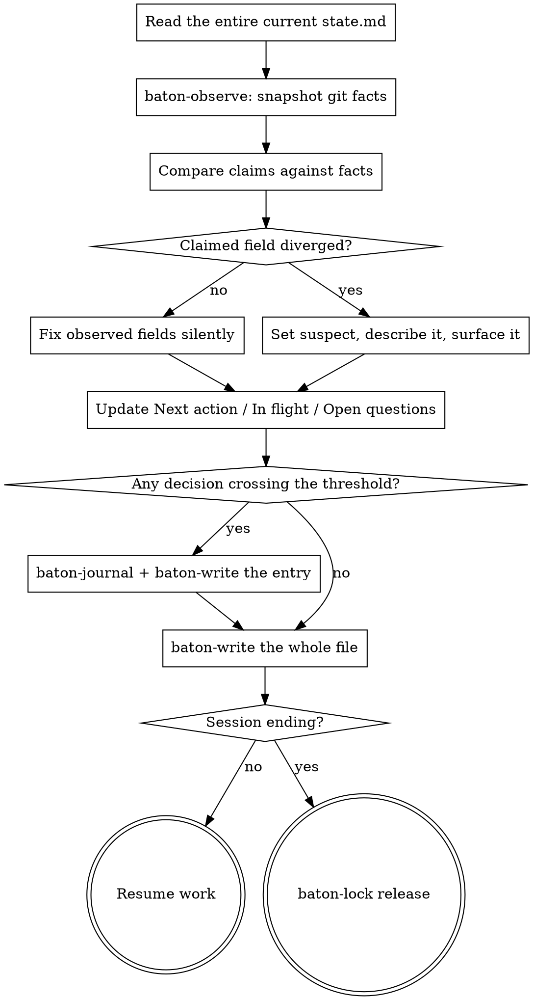

# baton Checkpoint

Persist the run so a session with no memory of this one can continue it.

**Announce at start:** "Checkpointing before we lose this context."

**Prerequisite:** you hold the writer lease. If `baton-lock check <session-id>`
exits non-zero, resolve that first — see `baton-resume`.

Then run `baton-lock acquire <session-id>` before writing anything. For the
holder that is not a second acquisition, it is the heartbeat: it pushes the
lease expiry out. A session that checkpoints regularly never lets its lease
lapse, and a session that has stopped checkpointing has stopped working, which
is exactly when someone else should be allowed to take the baton.

## The Process



## Steps

**1. Read the current state, whole.** Read all of `docs/baton/state.md`
before you change anything. You are editing a document, not composing one:
`baton-write` replaces the entire file with whatever you pipe into it, so
every section you did not deliberately change — the Waves table, the Goal,
the Operating mode, the Non-negotiables, the Pointers, all of it — has to
come through into your draft byte for byte. A step below that only mentions
the fields you're updating is not telling you the rest is optional; it is
assuming you already have the rest, from this step.

**2. Snapshot the repository.**

```bash
"${CLAUDE_PLUGIN_ROOT}/scripts/baton-observe"
```

**3. Reconcile.** Compare what `state.md` claims against what came back.
Observed fields — `observed_sha`, `observed_branch`, `tree_clean` — you
overwrite without ceremony. A claimed field that diverged — a wave marked
`done` whose work is not in the repository — you never overwrite: set
`suspect: true`, put the specifics in the `Suspect` line, and say so in your
reply.

**4. Write the narrative fields.**

- `Next action` — one sentence, deterministic enough that a session with no
  memory of this one executes it without asking. "Continue the API work" is a
  failure. "Run `npm test -- auth.spec.ts` and fix the two failing assertions
  in `src/auth/session.ts`" is not.
- `In flight` — what was interrupted mid-way, or `nothing`.
- `Open questions` — or `none`.

`state.md` is capped at 60 lines, and the cap is not advisory. A state file
that outgrows it stops doing its job: it is supposed to be something a
session with no memory of this one can take in whole, and a file that no
longer fits that is a file that stops getting read closely. If a field
doesn't fit — a long "In flight" description, a Suspect writeup with detail
worth keeping — the detail goes to a journal entry, and `state.md` keeps
only a pointer to it (e.g. "see DEC-0008").

**5. Journal anything that crossed the threshold.** The four criteria are in
the `baton` skill. Allocate the id, then write:

```bash
"${CLAUDE_PLUGIN_ROOT}/scripts/baton-journal" chose-postgres-over-sqlite
# id=DEC-0008
# path=docs/baton/journal/0008-chose-postgres-over-sqlite.md
```

Entry format:

```markdown
---
id: DEC-0008
type: decision
status: accepted
decided_by: agent
wave: 2
timestamp: 2026-08-03T14:20:00Z
sha: a1b2c3d
reversibility: two-way
blast_radius: low
needs_review: false
---
## Context
## Options
## Decision
## Why
## Invalidated if
```

Two other entry types are required elsewhere in these skills. Same envelope,
same `baton-journal` allocation, different `type` and sections:

- **`takeover`** — written by `baton-resume` when it displaces another
  session's lease. `type: takeover`. Sections: `## Who was displaced` and
  `## Why it was believed safe`.
- **`incoming`** — written when new input arrives mid-run (see the `baton`
  skill's "New input mid-run"). `type: incoming`, `needs_review: true`.
  Sections: `## What arrived`, `## From whom`, and `## What it affects`.

Pipe it through `baton-write` so it lands atomically and gets committed:

```bash
"${CLAUDE_PLUGIN_ROOT}/scripts/baton-write" \
    -m "baton: DEC-0008 chose postgres over sqlite" \
    docs/baton/journal/0008-chose-postgres-over-sqlite.md < /tmp/entry.md
```

**6. Write the state.** The content you pipe into `baton-write` here is the
*whole file* — frontmatter, Goal, Operating mode, Non-negotiables, the Waves
table, Now, Pointers — everything you read in step 1, with only the changes
you made deliberately in steps 3 and 4 applied on top. Not a diff. Not the
fields this checkpoint happened to touch.

```bash
"${CLAUDE_PLUGIN_ROOT}/scripts/baton-write" \
    -m "baton: checkpoint at wave 2" docs/baton/state.md < /tmp/state.md
```

If nothing of substance changed, the script writes nothing and exits 0. That
is correct, not a failure — running the ritual twice in a row leaves no trace.

**7. Release the lease if the session is ending.** Mid-stretch, keep it —
you're still working, and releasing it invites a takeover of a session that
hasn't gone anywhere. But if this checkpoint is the end of the session,
release it once the state write above has succeeded:

```bash
"${CLAUDE_PLUGIN_ROOT}/scripts/baton-lock" release "$CLAUDE_SESSION_ID"
```

A released lease means the next session starts clean: `acquire` succeeds
outright instead of finding a live lease it has to decide whether to take
over. Every takeover gets journaled, so a lease left behind after an
ordinary, clean end of session manufactures a journal entry for an overlap
that never happened — noise in exactly the log that has to stay signal.

## Closing a wave

`baton-verify` and `baton-gate` — the scripted gate that would set `done` for
you — are not built yet; that's separate, later work. Until they exist, you
are the only mechanism available, so use it deliberately rather than
inventing a substitute or stalling: a wave moves to `done` only when every
exit criterion listed for it in the constitution has been checked, one by
one, against the repository — not against your impression of the work — with
the check recorded, and only when the human has confirmed it. Either half
missing — an unchecked criterion, or no confirmation — means it stays where
it is.

## If the write fails

`baton-write` exits non-zero for reasons that need different responses. Do not
retry blindly — the exit code tells you which situation you are in.

| Exit | Meaning | What to do |
|---|---|---|
| 3 | Refused before touching anything — a merge or rebase is in progress, the path is gitignored, or empty content was piped over a file that has real content | Resolve the named condition, then checkpoint again. Nothing was written, so nothing is lost. |
| 5 | Two different causes, told apart by the message. "commit failed; the tree was restored" means a hook or a signing failure rejected the mutation and the rollback ran — the tree is back to how it was found. "commit landed but does not contain what this run wrote" means the commit *succeeded* but another writer's content is what's in it — nothing was rolled back, the commit stands. | First case: read the message, fix the cause, checkpoint again. Second case: do not retry over it — the lease discipline failed upstream (two writers held it at once); report that rather than silently re-checkpointing. |
| 7 | The commit failed **and** the rollback could not restore the tree | Stop. State is sitting outside the log and only a human can resolve it. Set `needs_human: true` if you can still write, and say so plainly. |

Exit 0 with no commit is not a failure — see step 6.

## Verify before claiming success

`git status --porcelain docs/baton` must be empty. If it is not, state is
sitting in the working tree outside the log and the checkpoint did not happen.
Say so rather than reporting success.

## Red Flags

| Thought | Reality |
|---|---|
| "Next action is obvious, I'll keep it short" | Obvious to you, with context. Write it for someone with none. |
| "I'll checkpoint after this one last thing" | The compaction does not wait for you. |
| "The wave is basically done, I'll mark it done" | The gate isn't built yet. Until it is, `done` needs every exit criterion checked against the repository, one by one, and the human's confirmation — see Closing a wave. |
| "State didn't change, something is broken" | An idle checkpoint writing nothing is the designed behaviour. |
| "I'll note the divergence in my reply instead of the file" | Your reply dies with the context. The file does not. |
| "I'll write the fields that changed" | `baton-write` replaces the whole file. Anything you did not carry over is deleted, and the tree still looks clean. |
