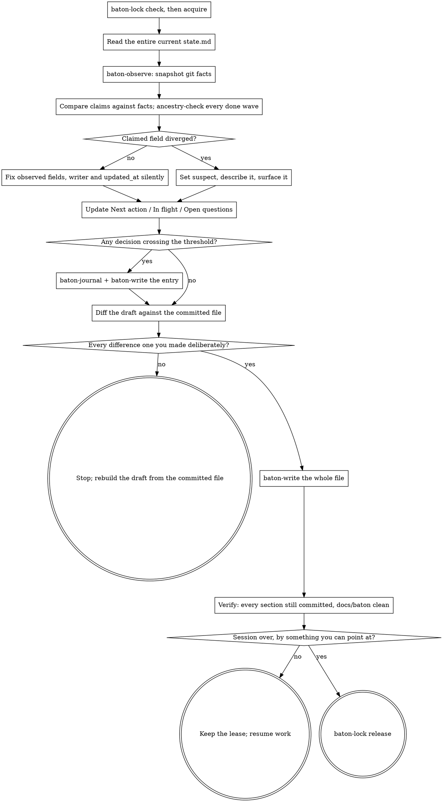

# baton Checkpoint

Persist the run so a session with no memory of this one can continue it.

**Announce at start:** "Checkpointing the run — writing it down so it survives without this context."

**Prerequisite:** `docs/baton/constitution.md`'s `status` is `ratified` with no
`REPLACE-WITH` token left — checkpointing a run that was never handed over
records state for a run that does not exist yet. You also hold the writer lease:

```bash
"${CLAUDE_PLUGIN_ROOT}/scripts/baton-lock" check "${CLAUDE_CODE_SESSION_ID:-$CLAUDE_SESSION_ID}"
```

Read the exit code, not just whether it was zero — non-zero does not mean "go
elsewhere and sort this out":

| Exit | Meaning | What to do |
|---|---|---|
| 0 | The lease is already yours. | Continue. |
| 3 | Another session holds a live lease. | Stop, report it, write nothing — see `baton-resume`. |
| 4 | The lease expired. | Continue to `acquire`; it takes over an expired lease itself. |
| 5 | There is no lease at all. | Continue to `acquire`; it takes a free lease itself. |

Then `acquire`, before writing anything:

```bash
"${CLAUDE_PLUGIN_ROOT}/scripts/baton-lock" acquire "${CLAUDE_CODE_SESSION_ID:-$CLAUDE_SESSION_ID}"
```

Both names, in that order: `CLAUDE_CODE_SESSION_ID` is what Claude Code exports,
but neither name is a documented contract, so the fallback is what survives the
next rename. Exit 64, session id must not be empty, means the environment gave
neither — report it and stop; do not invent an id.

If `acquire` prints `takeover=<previous session>` — it does when it displaces
the expired lease of exit 4 — journal it as a `takeover` entry (step 5), so two
sessions cannot silently overlap.

For the holder that `acquire` is the heartbeat, not a second acquisition: it
pushes the expiry out. Checkpoint regularly and the lease never lapses; a
session that stopped checkpointing stopped working, which is exactly when
someone else should get the baton.

## The Process



## Steps

**1. Read the current state, whole.** Read all of `docs/baton/state.md` before
changing anything. You are editing a document, not composing one: `baton-write`
replaces the entire file with whatever you pipe into it, so every section you
did not deliberately change — Goal, Operating mode, Non-negotiables, Waves
table, Pointers, all of it — has to come through into your draft byte for byte.
The steps below name only the fields they update; they assume you already have
the rest, from here.

**2. Snapshot the repository.**

```bash
"${CLAUDE_PLUGIN_ROOT}/scripts/baton-observe"
```

**3. Reconcile.** Compare what `state.md` claims against what came back.
Observed fields — `observed_sha`, `observed_branch`, `tree_clean` — you
overwrite without ceremony. Take `observed_sha` from `baton-observe`'s
`work_sha`, not its `sha`: `sha` is raw `HEAD`, which this checkpoint is about
to move by committing `state.md`, so a baseline read from it is wrong the moment
it is written. `work_sha` is the last commit touching anything outside
`docs/baton/` — which a checkpoint commit never does.

`writer` and `updated_at` are overwritten the same way, and both are almost
certainly stale: nothing has written either since `/baton:init`.

```bash
printf 'writer: %s\n' "${CLAUDE_CODE_SESSION_ID:-$CLAUDE_SESSION_ID}"
printf 'updated_at: %s\n' "$(date -u +%Y-%m-%dT%H:%M:%SZ)"
```

`writer` reads as naming whoever holds the lease right now, so carrying the init
session's id through a multi-day run is worse than naming nobody. Bump
`updated_at` freely: `baton-write` strips that line before deciding whether a
checkpoint is idle, precisely so a timestamp alone cannot manufacture a commit.

A claimed field that diverged — a wave marked `done` whose work is not in the
repository — you never overwrite: set `suspect: true`, put the specifics in the
`Suspect` line, and say so in your reply. "Diverged" is a check, not an
impression, and `baton-observe` cannot make it for you: a sha, a branch and a
dirty count say nothing about whether wave 2 is done. For every `done` row, run
the check `baton-resume` runs:

```bash
git merge-base --is-ancestor <closed_at_sha> HEAD
```

Any non-zero exit — 1 and 128 alike — is a divergence; the codes are tabulated
in `baton-resume`'s step 2. A `done` row whose `closed_at_sha` is still `—`
fails as exit 128, which is the right answer, not a technicality: nothing
recorded the sha, so the claim cannot be checked at all, and unverifiable is
indistinguishable from false from outside. Running it here finds the divergence
at a checkpoint instead of only at the resume after the next compaction.

**4. Write the narrative fields.**

- `Next action` — one sentence, deterministic enough that a session with no
  memory of this one executes it without asking. "Continue the API work" is a
  failure. "Run `npm test -- auth.spec.ts` and fix the two failing assertions
  in `src/auth/session.ts`" is not.
- `In flight` — what was interrupted mid-way, or `nothing`.
- `Open questions` — or `none`.

Write these from the repository, not from your recollection of the last hour —
the recollection is the thing about to be compacted:

```bash
"${CLAUDE_PLUGIN_ROOT}/scripts/baton-observe" --changed-since <observed_sha>
```

takes the `observed_sha` you read in step 1 — the previous checkpoint's
baseline, not the one you just overwrote — and lists every file changed since,
untracked ones included.

`state.md` is capped at 60 lines, and the cap is not advisory: the file has to
be something a session with no memory of this one can take in whole, and one
that outgrows that stops getting read closely. Detail that does not fit — a long
"In flight", a Suspect writeup worth keeping — goes to a journal entry, and
`state.md` keeps only a pointer to it (e.g. "see DEC-0008").

**5. Journal anything that crossed the threshold.** Write an entry only if at
least one holds:

- the decision is hard to reverse;
- it touches something outside the declared scope of the current wave;
- it reinterprets a rule from the constitution;
- the choice was between real alternatives and the loser was plausible.

They are spelled out here because nothing loads the `baton` skill when this one
fires, and a threshold you have to go and fetch is one you judge by feel.
`baton` carries the reasoning behind each, and the rule that entries are
immutable — superseding one means a new entry, never an edit.

Allocate the id, then write:

```bash
"${CLAUDE_PLUGIN_ROOT}/scripts/baton-journal" chose-postgres-over-sqlite
# id=DEC-0008
# path=docs/baton/journal/0008-chose-postgres-over-sqlite.md
```

Entry format:

```markdown
---
id: DEC-0008
type: decision
status: accepted
decided_by: agent
wave: 2
timestamp: 2026-08-03T14:20:00Z
sha: a1b2c3d
reversibility: two-way
blast_radius: low
needs_review: false
---
## Context
## Options
## Decision
## Why
## Invalidated if
```

Two other entry types are required elsewhere in these skills — same envelope,
same `baton-journal` allocation, different `type` and sections:

- **`takeover`** — whenever a `baton-lock` call prints
  `takeover=<previous session>`: `baton-resume` displacing another session's
  lease, or the `acquire` above taking over an expired one. `type: takeover`;
  sections `## Who was displaced`, `## Why it was believed safe`.
- **`incoming`** — when new input arrives mid-run (see the `baton` skill's "New
  input mid-run"). `type: incoming`, `needs_review: true`; sections
  `## What arrived`, `## From whom`, `## What it affects`.

Pipe it through `baton-write` so it lands atomically and gets committed:

```bash
"${CLAUDE_PLUGIN_ROOT}/scripts/baton-write" \
    -m "baton: DEC-0008 chose postgres over sqlite" \
    docs/baton/journal/0008-chose-postgres-over-sqlite.md < .baton/journal-entry.md
```

`.baton/` is the scratch directory for this write and the state draft below, not
`/tmp`. It already exists — the lease you took at the top created it — and
`/baton:init` put it in `.gitignore` before anything was committed, so scratch
never reaches the log. A fixed filename is enough because `.baton/` is
per-repository and the lease refuses a second session inside this repository. Do
not add `$$` to make it unique anyway — the tool that writes the draft and the
shell that reads it are different processes, and would not agree on the name.

**6. Check the draft against what is committed.** Write the draft to
`.baton/checkpoint-state.md` — step 7 pipes it from there anyway — and diff it
against the version in the log before anything is written:

```bash
diff <(git show HEAD:docs/baton/state.md) .baton/checkpoint-state.md
```

Every line on the `<` side is a line this checkpoint deletes. Take them one at a
time and name the step that decided each: an observed field or `writer` from
step 3, a `Now` line from step 4, a wave row you closed. A difference you cannot
name is not a change but a section that fell out of a draft rebuilt from memory,
and it aborts the checkpoint: re-read the committed file, apply your changes to
*that*, and diff again.

Nothing downstream catches this. `baton-write` writes what it is given, the
commit lands, the tree comes back clean — a checkpoint that dropped the Goal,
the Non-negotiables and half the Waves table is indistinguishable from a good
one afterwards; reproduced, a 41-line state file replaced by a 16-line draft,
exit 0. The script's guards do not help: the whitespace refusal fires only on a
draft with no non-whitespace byte at all, and the 60-line cap is a ceiling,
never a floor.

**7. Write the state.** What you pipe into `baton-write` is the whole file you
just diffed, unchanged since you diffed it.

```bash
"${CLAUDE_PLUGIN_ROOT}/scripts/baton-write" \
    -m "baton: checkpoint at wave 2" docs/baton/state.md < .baton/checkpoint-state.md
```

If nothing of substance changed, the script writes nothing and exits 0. That is
correct, not a failure — running the ritual twice in a row leaves no trace.

**8. Release the lease only if the session is over.** Mid-stretch, keep it.
Releasing a lease you are still using invites not a visible takeover but a
silent one: `acquire` against a free lease succeeds outright, prints no
`takeover=` line and journals nothing, so a second writer arrives in your run
leaving no trace anywhere.

"Over" has to be something you can point at, not a feeling: the human said they
are stopping, asked you to wrap up, or took the run back; or the last wave is
`done` with nothing left to pick up. A compaction is none of those, and it is
this skill's most common trigger — it takes the context, not the session, and
the same session keeps working straight through. When it is genuinely over,
release once the state write above has succeeded:

```bash
"${CLAUDE_PLUGIN_ROOT}/scripts/baton-lock" release "${CLAUDE_CODE_SESSION_ID:-$CLAUDE_SESSION_ID}"
```

Releasing means the next session starts clean: `acquire` succeeds outright
instead of facing a live lease it must decide whether to take over. Every
takeover is journaled, so a lease left behind after a clean end of session
manufactures an entry for an overlap that never happened — noise in exactly the
log that has to stay signal.

## Closing a wave

`baton-verify` and `baton-gate` — the scripted gate that would set `done` for
you — are not built yet; that is separate, later work. Until they exist you are
the only mechanism, so use it deliberately rather than inventing a substitute or
stalling: a wave moves to `done` only when every exit criterion the constitution
lists for it has been checked, one by one, against the repository — not against
your impression of the work — with the check recorded, and the human has
confirmed it. Either half missing means it stays where it is.

Closing the wave is then three edits to this checkpoint's draft, and it is not
closed until all three are in:

- `status` → `done` in the Waves table;
- `closed_at_sha` → this run's `work_sha` from `baton-observe`, not its `sha`,
  for the reason step 3 gives;
- **Current wave** → whatever is now in progress.

`closed_at_sha` is the only claim in this file anything checks mechanically:
`baton-resume` and step 3 above both run `git merge-base --is-ancestor` against
it for every wave marked `done`. Left at `—`, `done` is a claim with nothing
behind it, and both checks can only read that as a divergence.

## If the write fails

`baton-write` exits non-zero for reasons that need different responses; do not
retry blindly. These are all of them — exit 3 has enough distinct causes to get
a table of its own.

| Exit | Meaning | What to do |
|---|---|---|
| 1 | Not a git repository. Nothing was written. | Not something to work around: the lease, the log and every check here are git. Report it and stop. |
| 3 | Refused before touching anything — see the causes below. | Nothing was written, so nothing is lost. Resolve the named cause and checkpoint again. |
| 5 | Two causes, told apart by the message. "commit failed; the tree was restored" — a hook or signing failure rejected the mutation and the rollback ran, so the tree is as it was found. "commit landed but does not contain what this run wrote" — the commit *succeeded* with another writer's content in it; nothing was rolled back, the commit stands. | First: read the message, fix the cause, checkpoint again. Second: do not retry over it — the lease discipline failed upstream, two writers at once; report that rather than silently re-checkpointing. |
| 7, "rollback could not restore" | The commit failed **and** the rollback ran but left the tree dirty. State is sitting outside the log. | Stop. Only a human can resolve it. Set `needs_human: true` if you can still write, and say so plainly. |
| 7, "could not be verified" | The commit failed, the rollback ran, and `git status` itself failed, so whether the tree was restored is unknown. | Stop, the same way — but hand over the difference. "The tree is dirty" a human can look at and fix; "the repository could not answer what state it is in" is what they need to hear first. |
| 64 | Malformed invocation: no path, more than one path, or `-m` with nothing after it. Nothing was written. | Fix the call. The two forms this skill uses are the blocks in steps 5 and 7. |

Exit 3's causes, told apart by the message:

| Message says | What to do |
|---|---|
| an unresolved merge, or an unresolved rebase, is in progress | A partial commit of one path is impossible mid-merge or mid-rebase. Finish or abort it, then checkpoint again. |
| the path is excluded by `.gitignore` | The file could never be committed, so writing it would leave state `git status` never shows. Fix the ignore rule or the path. |
| empty-or-whitespace-only content over existing committed state | Your draft was empty or nothing but whitespace — a single newline counts, and that is what a failed command substitution or an empty heredoc usually produces. Rebuild it from the file you read in step 1. |
| does not resolve to a path inside the repository | Should never fire from this skill's own calls: `docs/baton/state.md` and the journal paths `baton-journal` hands back are always repo-root-relative. Something upstream built the wrong path. |
| refusing to write `docs/baton/constitution.md` | This skill only ever writes `state.md` and journal entries, so you targeted the wrong path. The constitution is never a checkpoint target. |
| over the 60-line cap | Move the excess detail into a journal entry (`baton-journal`), leave `state.md` holding only a pointer to it, and write again. |

Exit 0 with no commit is not a failure — see step 7.

## Verify before claiming success

Two conditions, and the second one alone proves nothing about the first.

**Every section is still in the committed file.**

```bash
git show HEAD:docs/baton/state.md | grep -nE '^(#|\*\*[A-Z]|\| [0-9])'
```

Goal, Operating mode, Non-negotiables, `## Waves` with one row per wave,
`## Now`, `## Pointers` — everything you read in step 1 has to be in that
output. Anything missing is the truncation step 6 exists to stop, and it is
already committed: recover the lost text from
`git show HEAD~1:docs/baton/state.md` and checkpoint again from a draft built on
it.

**`git status --porcelain docs/baton` is empty.** It cannot see a truncation —
`baton-write` committed that, so the tree is clean either way — but it catches
what the content check cannot: a rollback that left the tree dirty (exit 7), or
a stray untracked file under `docs/baton/`. If it is not empty, state is sitting
outside the log and the checkpoint did not happen. Say so rather than reporting
success.

## Red Flags

| Thought | Reality |
|---|---|
| "Next action is obvious, I'll keep it short" | Obvious to you, with context. Write it for someone with none. |
| "I'll checkpoint after this one last thing" | The compaction does not wait for you. |
| "The wave is basically done, I'll mark it done" | The gate isn't built yet. Until it is, `done` needs every exit criterion checked against the repository, one by one, plus the human's confirmation — see Closing a wave. |
| "State didn't change, something is broken" | An idle checkpoint writing nothing is the designed behaviour. |
| "I'll note the divergence in my reply instead of the file" | Your reply dies with the context. The file does not. |
| "I'll write the fields that changed" | `baton-write` replaces the whole file. Anything not carried over is deleted, the commit lands, and the tree still looks clean — step 6's diff is the only thing that catches it. |
| "`done` is set, I'll fill `closed_at_sha` later" | There is no later. The next checkpoint and the next resume both read `—` as a claim they cannot verify, and have to raise `suspect`. |
