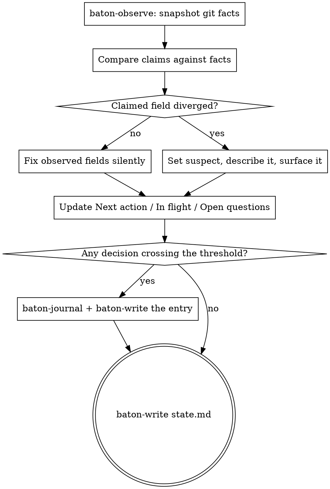

# baton Checkpoint

Persist the run so a session with no memory of this one can continue it.

**Announce at start:** "Checkpointing before we lose this context."

**Prerequisite:** you hold the writer lease. If `baton-lock check <session-id>`
exits non-zero, resolve that first — see `baton-resume`.

Then run `baton-lock acquire <session-id>` before writing anything. For the
holder that is not a second acquisition, it is the heartbeat: it pushes the
lease expiry out. A session that checkpoints regularly never lets its lease
lapse, and a session that has stopped checkpointing has stopped working, which
is exactly when someone else should be allowed to take the baton.

## The Process



## Steps

**1. Snapshot the repository.**

```bash
"${CLAUDE_PLUGIN_ROOT}/scripts/baton-observe"
```

**2. Reconcile.** Compare what `state.md` claims against what came back.
Observed fields — `observed_sha`, `observed_branch`, `tree_clean` — you
overwrite without ceremony. A claimed field that diverged — a wave marked
`done` whose work is not in the repository — you never overwrite: set
`suspect: true`, put the specifics in the `Suspect` line, and say so in your
reply.

**3. Write the narrative fields.**

- `Next action` — one sentence, deterministic enough that a session with no
  memory of this one executes it without asking. "Continue the API work" is a
  failure. "Run `npm test -- auth.spec.ts` and fix the two failing assertions
  in `src/auth/session.ts`" is not.
- `In flight` — what was interrupted mid-way, or `nothing`.
- `Open questions` — or `none`.

**4. Journal anything that crossed the threshold.** The four criteria are in
the `baton` skill. Allocate the id, then write:

```bash
"${CLAUDE_PLUGIN_ROOT}/scripts/baton-journal" chose-postgres-over-sqlite
# id=DEC-0008
# path=docs/baton/journal/0008-chose-postgres-over-sqlite.md
```

Entry format:

```markdown
---
id: DEC-0008
type: decision
status: accepted
decided_by: agent
wave: 2
timestamp: 2026-08-03T14:20:00Z
sha: a1b2c3d
reversibility: two-way
blast_radius: low
needs_review: false
---
## Context
## Options
## Decision
## Why
## Invalidated if
```

Pipe it through `baton-write` so it lands atomically and gets committed:

```bash
"${CLAUDE_PLUGIN_ROOT}/scripts/baton-write" \
    -m "baton: DEC-0008 chose postgres over sqlite" \
    docs/baton/journal/0008-chose-postgres-over-sqlite.md < /tmp/entry.md
```

**5. Write the state.**

```bash
"${CLAUDE_PLUGIN_ROOT}/scripts/baton-write" \
    -m "baton: checkpoint at wave 2" docs/baton/state.md < /tmp/state.md
```

If nothing of substance changed, the script writes nothing and exits 0. That
is correct, not a failure — running the ritual twice in a row leaves no trace.

## If the write fails

`baton-write` exits non-zero for reasons that need different responses. Do not
retry blindly — the exit code tells you which situation you are in.

| Exit | Meaning | What to do |
|---|---|---|
| 3 | Refused before touching anything — a merge or rebase is in progress, the path is gitignored, or empty content was piped over a file that has real content | Resolve the named condition, then checkpoint again. Nothing was written, so nothing is lost. |
| 5 | The commit failed and the tree was restored to how it was found | Read the message: a hook, a signing failure or a concurrent writer. Fix the cause. Do not retry until you know which. |
| 7 | The commit failed **and** the rollback could not restore the tree | Stop. State is sitting outside the log and only a human can resolve it. Set `needs_human: true` if you can still write, and say so plainly. |

Exit 0 with no commit is not a failure — see step 5.

## Verify before claiming success

`git status --porcelain docs/baton` must be empty. If it is not, state is
sitting in the working tree outside the log and the checkpoint did not happen.
Say so rather than reporting success.

## Red Flags

| Thought | Reality |
|---|---|
| "Next action is obvious, I'll keep it short" | Obvious to you, with context. Write it for someone with none. |
| "I'll checkpoint after this one last thing" | The compaction does not wait for you. |
| "The wave is basically done, I'll mark it done" | `done` is set by the gate, not by your estimate. |
| "State didn't change, something is broken" | An idle checkpoint writing nothing is the designed behaviour. |
| "I'll note the divergence in my reply instead of the file" | Your reply dies with the context. The file does not. |
