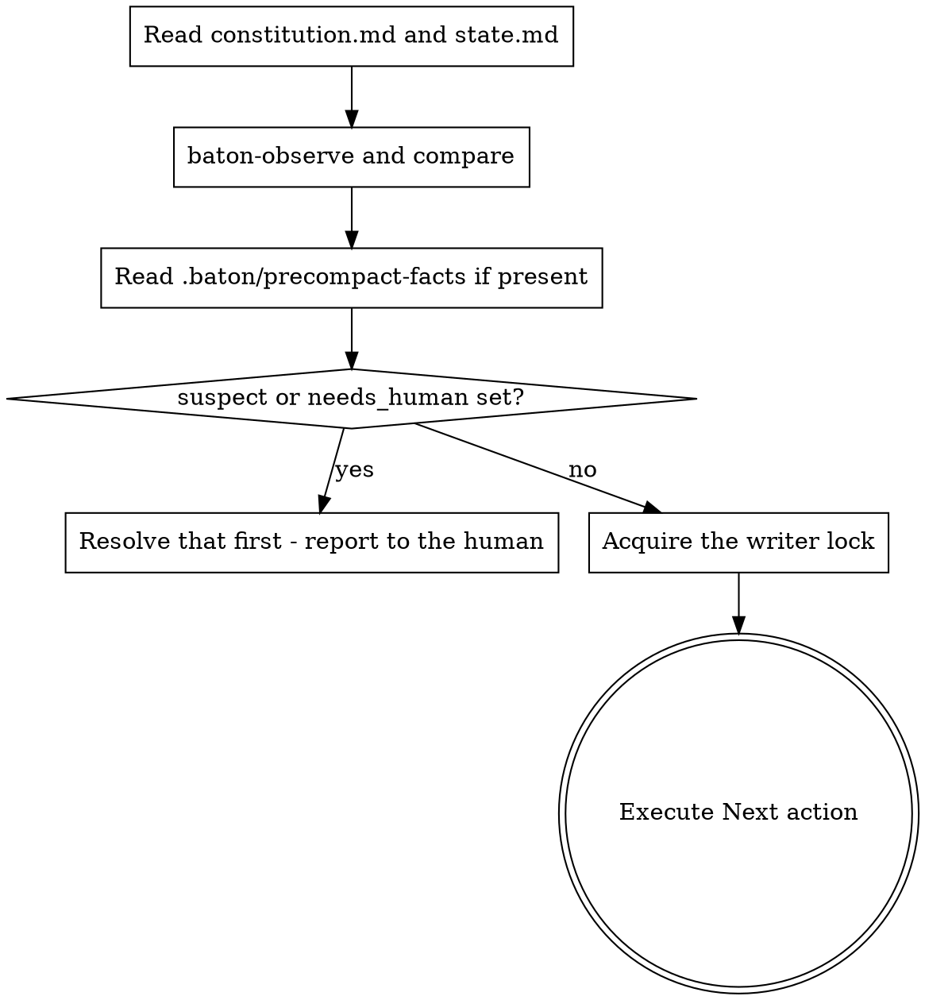

# baton Resume

Recover the run. Nothing else happens until this finishes.

**Announce at start:** "Restoring baton state before doing anything else."

Reading twice is safe. Nothing is written here except repairs to observed
fields, so if you are unsure whether you already resumed, resume again.

## The Process



## Steps

**1. Read both files.** `docs/baton/constitution.md` first, then
`docs/baton/state.md`. From the constitution you take three things and they
are not optional: the goal, your operating mode, and the non-negotiables.
Restoring the goal without the constraints is how a run ends up correctly
serving the current request while violating the original brief.

Check `status` in the constitution's frontmatter before acting on any of it.
Anything other than `ratified`, or any `REPLACE-WITH` token still sitting in
the file, means the human has not finished writing it. Stop and ask for
ratification rather than guessing at intent.

**2. Verify rather than trust.**

```bash
"${CLAUDE_PLUGIN_ROOT}/scripts/baton-observe"
```

Compare against `observed_sha` and `observed_branch`. A wave marked `done`
whose `closed_at_sha` is not an ancestor of `HEAD` is a divergence, not a
rounding error:

```bash
git merge-base --is-ancestor <closed_at_sha> HEAD
```

**3. Check what happened after the last checkpoint.** If
`.baton/precompact-facts` exists, the PreCompact hook recorded the repository
state at compaction time. If its SHA is ahead of `observed_sha`, work landed
that no checkpoint captured — treat `state.md` as behind and reconcile before
continuing.

**4. Handle flags before anything else.** `suspect: true` means a claim
diverged from the repository. `needs_human: true` means the run is stopped.
Either one is the whole job until it is resolved; report it and stop rather
than working around it.

**5. Take the writer role.**

```bash
"${CLAUDE_PLUGIN_ROOT}/scripts/baton-lock" acquire "$CLAUDE_SESSION_ID"
```

Exit 3 means another session holds an unexpired lease — do not write state; say
so, and stop. If you have good reason to believe that session is gone, run
`baton-lock takeover "$CLAUDE_SESSION_ID"` instead; it always succeeds.

Either way, whenever the script prints `takeover=<previous session>`, record a
journal entry of type `takeover` so a silent overlap of two sessions cannot
happen unnoticed.

**6. Execute `Next action`.** Exactly what it says. If it is too vague to act
on, that is a checkpoint-quality failure — reconstruct from the repository and
the wave's plan rather than guessing, and write a sharper `Next action` at the
next checkpoint.

## Before implementing anything

Check whether it already exists. Grep for the behaviour, not only for the name
you expect it to have; read the wave's plan and the closed waves' specs. On
fresh context you have no memory of what was built, and concluding "not
implemented" from one failed search is the documented way an agent overwrites
working code.

## Red Flags

| Thought | Reality |
|---|---|
| "I know roughly where we were" | You do not. That is what the compaction took. |
| "state.md says done, good enough" | Claims are checked against the repository, not accepted. |
| "suspect is set but I can work around it" | Resolving it is the work. |
| "The lock is held, I'll write anyway" | Two writers is exactly the failure the lock exists to prevent. |
| "I'll re-read the constitution later if needed" | Later is after you have already drifted. |
| "This function is missing, I'll add it" | Search first, by behaviour. |
| "The lease expired, so I'll just take it" | Expired means unobserved, not abandoned. Take it deliberately with `takeover` and journal it. |
