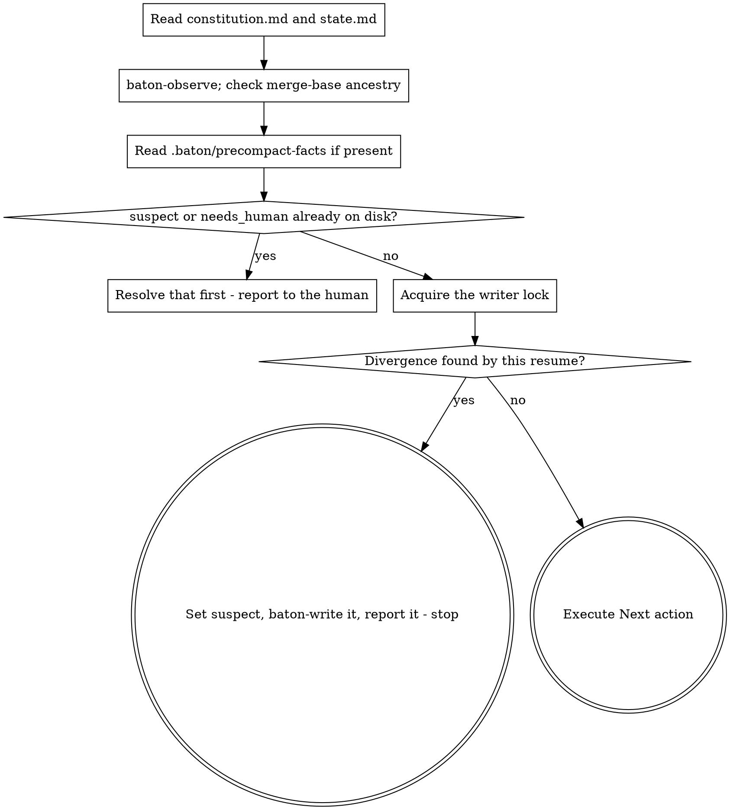

# baton Resume

Recover the run. Nothing else happens until this finishes.

**Announce at start:** "Restoring baton state before doing anything else."

Running this twice is safe, but that no longer means nothing is written.
Repairing observed fields is a write; raising `suspect` when this run finds a
divergence is a write too, and both go through `baton-write` under the lease.
What makes a second run safe is that it is idempotent: run it again after
nothing has changed and `baton-write` has nothing new to commit, same as
`baton-checkpoint`'s idle case. If you are unsure whether you already
resumed, resume again — it will not double-write anything.

## The Process



## Steps

**1. Read both files.** `docs/baton/constitution.md` first, then
`docs/baton/state.md`. From the constitution you take three things and they
are not optional: the goal, your operating mode, and the non-negotiables.
Restoring the goal without the constraints is how a run ends up correctly
serving the current request while violating the original brief.

Check `status` in the constitution's frontmatter before acting on any of it.
Anything other than `ratified`, or any `REPLACE-WITH` token still sitting in
the file, means the human has not finished writing it. Stop and ask for
ratification rather than guessing at intent.

**2. Verify rather than trust.**

```bash
"${CLAUDE_PLUGIN_ROOT}/scripts/baton-observe"
```

Compare `observed_sha` against this run's `work_sha`, not its `sha` — `sha` is
raw `HEAD`, which moves on every checkpoint commit, so it would never equal a
baseline recorded by the checkpoint before it; `work_sha` is the last commit
that touched anything outside `docs/baton/`, which a checkpoint commit never
does, so it stays put across checkpoints and actually changes when work
lands. Also compare `observed_branch`. Both are observed fields, repair them
silently. A wave marked `done` whose `closed_at_sha` is
not an ancestor of `HEAD` is a different kind of finding: `closed_at_sha` is
a claimed field, so this is a divergence, not a rounding error, and it is
never repaired silently:

```bash
git merge-base --is-ancestor <closed_at_sha> HEAD
```

Read the exit code; do not just ask whether it was zero:

| Exit | Meaning |
|---|---|
| 0 | `<closed_at_sha>` is an ancestor of `HEAD`. The claim holds. |
| 1 | It is not an ancestor. The claim diverged from the repository. |
| 128, message starts `fatal:` | `<closed_at_sha>` is not a valid commit at all — a placeholder never filled in, or history rewritten out from under it. |

Any non-zero exit — 1 or 128 alike — is the same finding: the claimed field
diverged. 128 is not a crash to report and move past; treat it exactly like
1. You do not hold the lease yet, so you cannot write this down until step 5
— for now, just note it.

**3. Check what happened after the last checkpoint.** If
`.baton/precompact-facts` exists, the PreCompact hook recorded the repository
state at compaction time. Compare its `work_sha` — not its `sha` — against
`observed_sha`. If they differ, work landed that no checkpoint captured —
treat `state.md` as behind. This is the same kind of finding as step 2's:
note it, you still don't hold the lease.

**4. Handle flags already on disk before anything else.** `suspect: true` in
the `state.md` you read in step 1 means a claim already diverged, caught by
an earlier session's checkpoint or resume. `needs_human: true` means the run
is already stopped. Either one, found already set, is the whole job until a
human resolves it; report it and stop rather than working around it. This is
distinct from anything steps 2 and 3 just found themselves — that is handled
next, in step 6, once you hold the lease.

**5. Take the writer role.**

```bash
"${CLAUDE_PLUGIN_ROOT}/scripts/baton-lock" acquire "$CLAUDE_SESSION_ID"
```

Exit 3 means another session holds an unexpired lease — do not write state; say
so, and stop. If you have good reason to believe that session is gone, run
`baton-lock takeover "$CLAUDE_SESSION_ID"` instead; it always succeeds.

Either way, whenever the script prints `takeover=<previous session>`, record a
journal entry of type `takeover` so a silent overlap of two sessions cannot
happen unnoticed.

**6. If this resume found a divergence, write it and stop.** Steps 2 and 3
may have turned up something step 4's on-disk flags did not already cover: a
`closed_at_sha` no longer an ancestor of `HEAD`, or a precompact `work_sha`
that does not match `observed_sha`. If either is true, now that you hold the
lease:

- set `suspect: true`;
- describe the specifics in the `Suspect` line — which check failed and what
  each side said;
- write it through `baton-write`;
- report it.

Then stop. A suspect run does not continue to `Next action` — resolving the
divergence is the next thing that happens here, not a background fact you
carry into the next step.

**7. Execute `Next action`.** Reached only when step 6 found nothing new.
Exactly what it says. If it is too vague to act on, that is a
checkpoint-quality failure — reconstruct from the repository and the wave's
plan rather than guessing, and write a sharper `Next action` at the next
checkpoint.

## Before implementing anything

Check whether it already exists. Grep for the behaviour, not only for the name
you expect it to have; read the wave's plan and the closed waves' specs. On
fresh context you have no memory of what was built, and concluding "not
implemented" from one failed search is the documented way an agent overwrites
working code.

## Red Flags

| Thought | Reality |
|---|---|
| "I know roughly where we were" | You do not. That is what the compaction took. |
| "state.md says done, good enough" | Claims are checked against the repository, not accepted. |
| "suspect is set but I can work around it" | Resolving it is the work. |
| "The lock is held, I'll write anyway" | Two writers is exactly the failure the lock exists to prevent. |
| "I'll re-read the constitution later if needed" | Later is after you have already drifted. |
| "This function is missing, I'll add it" | Search first, by behaviour. |
| "The lease expired, so I'll just take it" | Expired means unobserved, not abandoned. Take it deliberately with `takeover` and journal it. |
