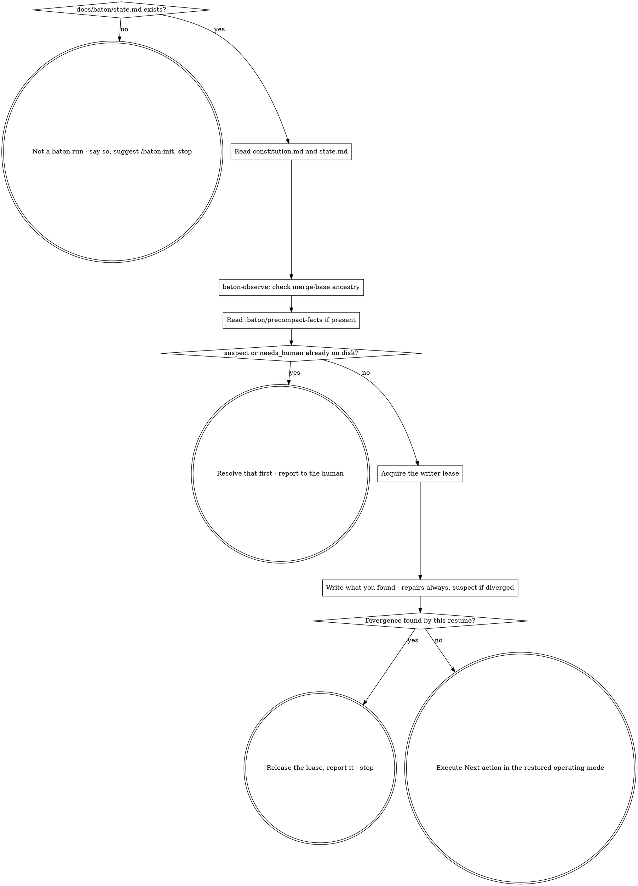

# baton Resume

Recover the run. Nothing else happens until this finishes.

**Announce at start:** "Restoring baton state before doing anything else."

This skill writes. Repairing observed fields is a write, and raising a
divergence this run found is a write too, and both go through `baton-write`
under the writer lease. Running it twice is still safe, because it is
idempotent: run it again after nothing has changed and `baton-write` has
nothing new to commit, same as `baton-checkpoint`'s idle case. If you are
unsure whether you already resumed, resume again — it will not double-write
anything.

## The Process



## Steps

**0. Is this a baton run at all?** If `docs/baton/state.md` does not exist,
this repository is not a baton run: say so, suggest `/baton:init`, and stop.
Create nothing — not the directory, not a state file, not a constitution.
This skill triggers on a session starting and on the word "continue", which
happen in every repository on the machine, so a missing state file is the
ordinary case rather than a fault to report at length. A Read error on a file
that was never meant to exist is the worst possible first move here: you have
less context right now than at any other point in the run, and nothing to
improvise from.

**1. Read both files.** First pin the working directory to the repository
root:

```bash
cd "$(git rev-parse --show-toplevel)"
```

Every path in this skill — `docs/baton/state.md`, `.baton/precompact-facts` —
is relative to that root. A session that started in a subdirectory of a
monorepo resolves them against `packages/foo/` instead, finds nothing there,
and concludes there is no run to resume. Every script in this plugin and both
hooks re-resolve to the top level for exactly this reason; `hooks/pre-compact`
records that this bug once left two sessions sharing a lease that had landed
in a subdirectory, each believing it held it alone. This skill inherits the
same risk and runs first, on fresh context, so it does the same thing for
itself.

Then read `docs/baton/constitution.md` first, and `docs/baton/state.md`
second. From the constitution you take three things and they are not
optional: the goal, your operating mode, and the non-negotiables. Restoring
the goal without the constraints is how a run ends up correctly serving the
current request while violating the original brief. The operating mode is who
you are for the rest of this session, and step 7 means it literally: if it
says orchestrator, you delegate the work rather than doing it here.

Check `status` in the constitution's frontmatter before acting on any of it.
Anything other than `ratified` means the human has not finished writing it —
stop and ask for ratification rather than guessing at intent.

A `REPLACE-WITH` placeholder still sitting in the file means the same thing,
but check for a *frontmatter field whose value begins with the token*, not
for the string appearing anywhere. The shipped template carries `REPLACE-WITH`
inside a frontmatter *comment* that explains the ratification rule, and a
comment can survive untouched into a perfectly ratified constitution. A
substring match then halts every resume of that run, permanently, over a line
that is documentation.

**2. Verify rather than trust.**

```bash
"${CLAUDE_PLUGIN_ROOT}/scripts/baton-observe"
```

Three fields in `state.md`'s frontmatter describe the repository rather than
claiming anything about the work — `observed_sha`, `observed_branch` and
`tree_clean`. All three are repaired silently when they disagree with what
came back: they are a stale reading of the repository, and the repository is
right. Note the repairs as you go. You do not hold the lease yet, so nothing
is written until step 6.

Compare `observed_sha` against this run's `work_sha`, not its `sha` — `sha` is
raw `HEAD`, which moves on every checkpoint commit, so it would never equal a
baseline recorded by the checkpoint before it; `work_sha` is the last commit
that touched anything outside `docs/baton/`, which a checkpoint commit never
does, so it stays put across checkpoints and actually changes when work lands.
An empty `work_sha` is not a failure: it means no commit outside `docs/baton/`
is reachable from `HEAD` yet. Then compare `observed_branch`.

`tree_clean: false` is the third, and on a resume it is the one that matters
most: uncommitted work is sitting in the tree, and the most common reason is a
session that died mid-edit — the session you are picking up from. Find out
what it is before you touch anything:

```bash
"${CLAUDE_PLUGIN_ROOT}/scripts/baton-observe" --changed-since "<observed_sha>"
```

That lists every path changed since the last checkpoint's baseline, untracked
files included. Reconcile it against `In flight`: if they describe the same
work, you have found the interrupted edit and `In flight` says what it was
for. If `In flight` says `nothing` and the list is not empty, say so — that
is work nobody wrote down, and `Next action` was written for a clean tree.
Executing it over a working tree of unknown provenance is how the two get
tangled together.

A wave marked `done` whose `closed_at_sha` is not an ancestor of `HEAD` is a
different kind of finding: `closed_at_sha` is a claimed field, so this is a
divergence, not a rounding error, and it is never repaired silently. Check
every wave the table marks `done`, not only the most recent — a run on day
three has several, and the older claim is the likelier one to have been
rebased out from under. Skip any whose `closed_at_sha` is the template's `—`
placeholder: that cell means "not closed here", and handing it to `merge-base`
produces an exit 128 that reads as history moving when nothing did.

Capture the exit code and the message together. The table below keys one row
on what the command printed, so a bare invocation cannot tell you which row
you are in:

```bash
rc=0
out="$(git merge-base --is-ancestor <closed_at_sha> HEAD 2>&1)" || rc=$?
printf 'exit=%s message=%s\n' "$rc" "$out"
```

| Exit | Meaning |
|---|---|
| 0 | `<closed_at_sha>` is an ancestor of `HEAD`. The claim holds. |
| 1 | It is not an ancestor. The claim diverged from the repository. |
| 128, message starts `fatal:` | `<closed_at_sha>` is not a valid commit at all — a placeholder never filled in, or history rewritten out from under it. |

Any non-zero exit — 1 or 128 alike — is the same finding: the claimed field
diverged, and the run stops for it. 128 is not a crash to report and move
past. But record which code it was, and which wave, when you write the
`Suspect` line in step 6: they stop the run identically and they mean
different things to whoever has to resolve it. 1 says the commit exists and
the history moved past it; 128 says there is no such commit at all.

**3. Check what happened after the last checkpoint.** If
`.baton/precompact-facts` exists, the PreCompact hook recorded the repository
as it stood at compaction time.

If that file carries `observe_failed=true`, stop reading it there. The hook
writes that line, and deliberately no `work_sha` at all, when `baton-observe`
failed at compaction time — a comparison against an unknown `work_sha` is a
guess dressed up as a fact. An absent field reads back as an empty string,
which differs from every real `observed_sha`, so comparing anyway
manufactures a divergence on a healthy run out of the one case the hook went
to trouble to prevent. Say that no staleness check was possible this resume,
and move on to step 4.

Otherwise check the direction before comparing anything. If the precompact
`work_sha` is an ancestor of *both* the current `work_sha` and `observed_sha`
— same `merge-base` call as step 2 — the file is left over from an earlier
compaction that has already been checkpointed past. It establishes nothing.
`.baton/` is gitignored and nothing prunes it, so a spent file is the normal
fate of this path, not an edge case, and treating it as a mismatch would
raise a divergence on a healthy run at every resume from here to the end of
the run.

Otherwise compare the file's `work_sha` — not its `sha` — against the
`observed_sha` you read *from disk* in step 1, before step 2's repair. Step 2
sets that field from the same `baton-observe` output; comparing the repaired
value would be comparing a number against itself, and the check would never
fire. Three outcomes:

- **Equal.** The checkpoint was current when the compaction hit. Nothing
  follows from it.
- **`observed_sha` is an ancestor of the precompact `work_sha`.** Work landed
  after the last checkpoint and no checkpoint captured it. Repairing the sha
  is routine and step 2 already covers it — but `Next action`, `In flight`
  and the wave statuses were written alongside the old value and describe a
  repository that has since moved. Those are claimed fields, nobody has
  corrected them, and *that* is what stops the run: not the sha, the
  narrative written against it.
- **Neither is an ancestor of the other, or `merge-base` exits 128.** History
  moved — a rebase, a force-push, a branch that is not the branch it was.
  A genuine divergence, and the same stop.

Once the file has been acted on — meaning step 6's write has landed, or you
established above that it was spent — delete it:

```bash
rm -f .baton/precompact-facts
```

The next compaction writes a fresh one. Leaving a spent file behind means the
next resume re-litigates a question this one already answered, and the answer
only gets more wrong as the run goes on.

**4. Handle the flags that were already on disk.** Steps 0 to 3 are all
reads — nothing has changed yet, which is why they come first. This is the
first thing that decides anything. `suspect: true` in the `state.md` you read
in step 1 means a claim already diverged, caught by an earlier session's
checkpoint or resume. `needs_human: true` means the run is already stopped.
Either one, found already set, is the whole job until it is resolved; report
it and stop rather than working around it. This is distinct from anything
steps 2 and 3 just found themselves — that is handled in step 6, once you
hold the lease.

Resolution is not something you perform alone. `suspect` marks a claimed field
that disagrees with the repository, and which of the two is wrong is a
question about intent — was the wave actually finished, or was the commit
lost? — so it takes the human's decision, not your judgement. Put the
specifics in front of them: which field, what it claims, what the repository
shows, and what the `Suspect` line already says about how it was caught. Once
they have said what the truth is, you record it: a journal entry with their
decision and why, then a `baton-write` of `state.md` with the claimed field
set to what they said and `suspect: false`. That write is the only thing that
clears the flag — it does not expire, and no later checkpoint clears it for
you. Clearing it without that conversation is silently correcting a claim,
which is the exact thing the flag exists to prevent.

**5. Take the writer lease.**

```bash
"${CLAUDE_PLUGIN_ROOT}/scripts/baton-lock" acquire "${CLAUDE_CODE_SESSION_ID:-$CLAUDE_SESSION_ID}"
```

Both names, in that order, deliberately: `CLAUDE_CODE_SESSION_ID` is what
Claude Code actually exports, and neither name is a documented contract, so
the fallback is what keeps this working if the exported name changes again.
`baton-lock` refuses an empty id outright rather than granting a shared
lease, so exit 64 saying the session id must not be empty means the
environment gave neither name — report that and stop rather than inventing
an id.

Exit 3 means another session holds an unexpired lease — do not write state; say
so, and stop. If you have good reason to believe that session is gone, take it
over instead; that always succeeds:

```bash
"${CLAUDE_PLUGIN_ROOT}/scripts/baton-lock" takeover "${CLAUDE_CODE_SESSION_ID:-$CLAUDE_SESSION_ID}"
```

Either way, whenever the script prints `takeover=<previous session>` — which
`acquire` also prints when it displaces an expired lease — record a journal
entry of type `takeover`, so a silent overlap of two sessions cannot happen
unnoticed. The entry has a fixed shape and it is not written here: read the
`baton-checkpoint` skill's step 5, "Journal anything that crossed the
threshold", before writing it. You have no reason to have that skill loaded
this session, so open it. What you are looking for, so the trip is short:
`${CLAUDE_PLUGIN_ROOT}/scripts/baton-journal <slug>` hands back the id and
the path — never invent either — the frontmatter is the same envelope every
entry uses with `type: takeover`, the two required sections are
`## Who was displaced` and `## Why it was believed safe`, and the finished
entry reaches disk through `baton-write` at the path `baton-journal` printed.
Name the displaced session id the script actually printed, not "a previous
session".

**6. Write what you found.** This step always runs. You hold the lease now,
and everything steps 2 and 3 turned up exists only in your head — there is no
clean path that skips writing.

**Always:** the observed-field repairs from step 2. `observed_sha` set from
`baton-observe`'s `work_sha`, `observed_branch` and `tree_clean` set from what
it reported.

**And, if steps 2 or 3 found a divergence** that step 4's on-disk flags did
not already cover — a `closed_at_sha` no longer an ancestor of `HEAD`, or a
precompact `work_sha` whose narrative fields describe an older repository:

- set `suspect: true`;
- describe the specifics in the `Suspect` line: which check failed, what each
  side said, which wave, and, for the ancestry check, whether it exited 1 or
  128;
- report it, and stop. A suspect run does not continue to `Next action`.
  Resolving the divergence is the next thing that happens here, not a
  background fact carried into the next step, and step 4 says what resolving
  it means.

Both cases go through one command:

```bash
"${CLAUDE_PLUGIN_ROOT}/scripts/baton-write" \
    -m "baton: resume verified state" docs/baton/state.md < .baton/resume-state.md
```

What you pipe in is the *whole file* — frontmatter, Goal, Operating mode,
Non-negotiables, the Waves table, Now, Pointers — everything you read in step
1, byte for byte, with only the fields above changed on top. Not a diff, not
the fields this resume happened to touch. `baton-write` replaces the file with
its stdin; it does not merge and it cannot know what you meant to keep. Two
frontmatter lines piped in leaves a two-line `state.md` with the Waves table
gone, exit 0, committed, and `git status --porcelain docs/baton` empty
afterwards. Nothing downstream will tell you it happened.

`state.md` is capped at 60 lines and `baton-write` refuses anything longer — a
`Suspect` writeup with real detail is what usually pushes it over. Put the
detail in a journal entry and leave a pointer ("see DEC-0008") in the line.
For any other non-zero exit, `baton-checkpoint`'s "If the write fails" table
says which situation you are in and what each one needs; do not retry blindly.

If this write raised `suspect`, release the lease once it has succeeded:

```bash
"${CLAUDE_PLUGIN_ROOT}/scripts/baton-lock" release "${CLAUDE_CODE_SESSION_ID:-$CLAUDE_SESSION_ID}"
```

You are stopping, and the lease lives six hours. Held, it means the human's
next session finds a live lease and can only get past it with `takeover` —
which manufactures a journal entry for an overlap that never happened, noise
in exactly the log that has to stay signal. On the clean path, keep the
lease: you are about to work under it.

**7. Execute `Next action`, in the operating mode you restored in step 1.**
Reached only when step 6 found nothing that stops the run.

Exactly what it says — but "exactly what it says" governs the work, not who
does it. If step 1's operating mode is orchestrator, then delegating
`Next action` to a subagent or a workflow *is* executing it, and implementing
it here, in the primary session, is not. The mode came from the constitution;
it outranks the convenience of just doing the thing yourself.

If `Next action` is too vague to act on, that is a checkpoint-quality
failure — reconstruct from the repository and the wave's plan rather than
guessing, and write a sharper one at the next checkpoint.

## What you are working under from here

The procedure is over; the run is not. What governs the rest of the session is
the **baton** skill — read it now unless it is already in context. It is the
model these procedures implement: which fields are observed and which are
claimed, and why that decides what you may repair; the four criteria that make
a decision worth journaling; what to do when new input arrives mid-run.

**baton-checkpoint** is the other half of it. Checkpoint before the next
compaction, at the end of a stretch of work, and after closing anything
meaningful — it also carries the 60-line cap on `state.md`, the journal entry
formats, and the release of the lease when the session ends. A run that
resumes cleanly and then never checkpoints has only moved the loss to the next
compaction.

## Before implementing anything

Check whether it already exists. Grep for the behaviour, not only for the name
you expect it to have; read the wave's plan and the closed waves' specs. On
fresh context you have no memory of what was built, and concluding "not
implemented" from one failed search is the documented way an agent overwrites
working code.

## Red Flags

| Thought | Reality |
|---|---|
| "I know roughly where we were" | You do not. That is what the compaction took. |
| "The summary I woke up with reads complete" | Summaries always read complete. That is the premise this whole skill is built on. |
| "state.md says done, good enough" | Claims are checked against the repository, not accepted. |
| "suspect is set but I can work around it" | Resolving it is the work, and only the human can resolve it. |
| "The lease is held, I'll write anyway" | Two writers is exactly the failure the lease exists to prevent. |
| "I'll pipe the fields I changed into `baton-write`" | It replaces the whole file with your stdin. Anything you did not carry over is deleted, the commit succeeds, and the tree looks clean. |
| "The tree is dirty, that's just leftovers" | It is uncommitted work from the session you are picking up. Find out what it is before you build on it. |
| "I'll re-read the constitution later if needed" | Later is after you have already drifted. |
| "This function is missing, I'll add it" | Search first, by behaviour. |
| "The lease expired, so I'll just take it" | Expired means unobserved, not abandoned. Take it deliberately with `takeover` and journal it. |
