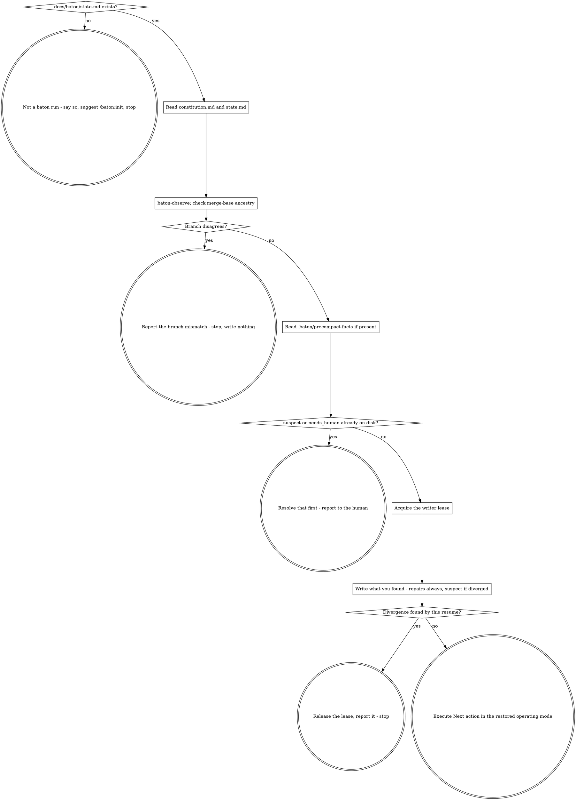

# baton Resume

Recover the run: nothing else happens until this finishes. **Announce at
start:** "Restoring baton state before doing anything else."

It writes only through `baton-write`, under the writer lease, and it is
idempotent: if you are unsure whether you already resumed, resume again.

## The Process



**0. Is this a baton run at all?** If `docs/baton/state.md` does not exist,
this is not a baton run: say so in one line, suggest `/baton:init`, stop.
Create nothing: not the directory, not a state file, not a constitution.

**1. Read both files.** Pin the working directory to the repository root with
`cd "$(git rev-parse --show-toplevel)"`; every path here resolves against it.
Then read `docs/baton/constitution.md` first, `docs/baton/state.md` second.
Four things from the constitution, none optional: the goal, your operating
mode, the non-negotiables, and `workspace`. The operating mode is who you are
for the rest of the session, and step 8 means it literally: orchestrator means
you delegate rather than implement here. `workspace` — `in-place` or
`worktree` — is the consent `superpowers:using-git-worktrees` would stop to
ask for: state it to that skill rather than letting it ask, since under the
autopilot nobody is there to answer.

Check `status` in its frontmatter before acting on any of it: anything other
than `ratified` means the human has not finished writing it — stop and ask for
ratification rather than guessing at intent. A `REPLACE-WITH` placeholder
means the same, but match a *frontmatter field whose value begins with the
token*, not the string anywhere in the file.

**2. Verify rather than trust.**

```bash
"${CLAUDE_PLUGIN_ROOT}/scripts/baton-observe"
```

`observed_sha` and `tree_clean` are observed — they describe the repository,
not the work. Repair both silently where they disagree with what came back,
but note the repairs rather than writing them; that is step 6, once you hold
the lease. Compare `observed_sha` against this run's `work_sha`, not its
`sha`; an empty `work_sha` is not a failure, only nothing outside
`docs/baton/` on `HEAD` yet.

Then compare `observed_branch` — and **do not repair it**. Report it and stop:
name the branch `state.md` expects and the branch you are on, go no further,
and do not switch branches to resolve it. **Write nothing, not even
`needs_human`:** you hold no lease, and the file you would write to is the one
you cannot establish is this run's.

`tree_clean: false` on a resume is most often uncommitted work from the
session you are picking up. Find out what it is before touching anything:

```bash
"${CLAUDE_PLUGIN_ROOT}/scripts/baton-observe" --changed-since "<observed_sha>"
```

That lists every path changed since that baseline, untracked included.
Reconcile against `In flight`: the same work means you have found the
interrupted edit. If `In flight` says `nothing` and the list is not empty, say
so before going further — `Next action` was written for a clean tree.

`closed_at_sha` on a wave marked `done` is claimed, so a mismatch there is a
divergence, never repaired silently: check every `done` wave, not only the
most recent. A `—` means no sha was recorded — on a wave that is not `done`
that is the default, so do not run the check against it at all; on a `done`
wave it is itself the divergence. Capture the exit code and the message
together, since one row keys on what the command printed:

```bash
rc=0
out="$(git merge-base --is-ancestor <closed_at_sha> HEAD 2>&1)" || rc=$?
printf 'exit=%s message=%s\n' "$rc" "$out"
```

| Exit | Meaning |
|---|---|
| 0 | `<closed_at_sha>` is an ancestor of `HEAD`. The claim holds. |
| 1 | It is not an ancestor. The claim diverged from the repository. |
| 128, message starts `fatal:` | `<closed_at_sha>` is not a valid commit at all — a placeholder never filled in, or history rewritten out from under it. |

Any non-zero exit, 1 or 128 alike, is the same finding: the claim diverged and
the run stops. Record which code and which wave in step 6's `Suspect` line.

**3. Check what happened after the last checkpoint.** Read
`.baton/precompact-facts` if present: the PreCompact hook wrote it with the
repository as it stood at compaction time. If it carries
`observe_failed=true`, stop reading there — no `work_sha` was recorded to
compare against. Say no staleness check was possible this resume, and go to
step 4.

Otherwise check direction first: if the precompact `work_sha` is an ancestor
of *both* the current `work_sha` and `observed_sha` — the `merge-base` call
from step 2 — the file is spent, an earlier compaction already checkpointed
past, and nothing prunes these files, so that is the ordinary case.

Otherwise compare the file's `work_sha` — not its `sha` — against the
`observed_sha` you read *from disk* in step 1, before step 2's repair:

| Comparison | What it means |
|---|---|
| Equal | The checkpoint was current when the compaction hit. Nothing follows. |
| `observed_sha` is an ancestor of the precompact `work_sha` | Work landed after the last checkpoint and nothing captured it. The sha repair is routine, step 2 covers it — but `Next action`, `In flight` and the wave statuses were written against the old value and nobody has corrected them, and *that* stops the run: not the sha, the narrative written against it. |
| Neither is an ancestor of the other, or `merge-base` exits 128 | History moved — a rebase, a force-push, a history rewritten under you. A genuine divergence, and the same stop. |

Once the file has been acted on — step 6's write has landed, or you
established it was spent — delete it: `rm -f .baton/precompact-facts`.

**4. Handle the flags that were already on disk.** Steps 0 to 3 only read, and
only step 2's branch disagreement stops there, without writing. `suspect: true`
in the `state.md` from step 1 means a claim already diverged, caught earlier;
`needs_human: true` means the run is already stopped. Either one, found
already set, is the whole job until resolved: report it and stop rather than
working around it. What steps 2 and 3 just found themselves is different —
that is step 6, once you hold the lease. The branch check is the exception: it
does not reach step 6, because it does not reach step 5.

Resolution is not yours alone. Put the specifics in front of the human: which
field, what it claims, what the repository shows, what the `Suspect` line says
about how it was caught. Then record what they decide: a journal entry with
the decision and why, then a `baton-write` of `state.md` with the claimed
field set to what they said and `suspect: false`. Nothing else clears it: the
flag does not expire, and no checkpoint clears it for you.

**5. Take the writer lease.**

```bash
"${CLAUDE_PLUGIN_ROOT}/scripts/baton-lock" acquire "${CLAUDE_CODE_SESSION_ID:-$CLAUDE_SESSION_ID}"
```

Exit 64 — the session id must not be empty — means the environment gave
neither name; report that and stop rather than inventing an id. Exit 3 means
another session holds an unexpired lease: do not write state, say so, stop. If
you have good reason to believe that session is gone, take it over instead —
that always succeeds:

```bash
"${CLAUDE_PLUGIN_ROOT}/scripts/baton-lock" takeover "${CLAUDE_CODE_SESSION_ID:-$CLAUDE_SESSION_ID}"
```

Either way, whenever the script prints `takeover=<previous session>` — which
`acquire` also prints when it displaces an expired lease — record a journal
entry of type `takeover`, naming the displaced session id the script actually
printed rather than "a previous session". Its shape is `baton-checkpoint`'s
step 5, "Journal anything that crossed the threshold":
`${CLAUDE_PLUGIN_ROOT}/scripts/baton-journal <slug>` hands back the id and the
path — never invent either — the frontmatter is the standard envelope with
`type: takeover`, the required sections are `## Who was displaced` and
`## Why it was believed safe`, and the entry reaches disk through
`baton-write` at the path `baton-journal` printed.

**6. Write what you found.** This step always runs; you hold the lease now.

**Always:** the observed-field repairs from step 2 — `observed_sha` set from
`baton-observe`'s `work_sha`, and `tree_clean` set from what it reported.
`observed_branch` is not on this list: step 2 does not repair it.

**And, if steps 2 or 3 found a divergence** that step 4's on-disk flags did
not already cover:

- set `suspect: true`;
- describe the specifics in the `Suspect` line: which check failed, what each
  side said, which wave, and whether the ancestry check exited 1 or 128;
- leave `needs_human` alone — `suspect` already says the run needs a human,
  and do not write a `Suspect` line that promises a flag you are not setting;
- report it, and stop. A suspect run does not continue to `Next action`; step
  4 says what resolving it means.

One command, two messages: `baton: resume verified state` when this resume
only repaired observed fields, `baton: resume found a divergence` when it
raised `suspect`.

```bash
"${CLAUDE_PLUGIN_ROOT}/scripts/baton-write" \
    -m "baton: resume verified state" docs/baton/state.md < .baton/resume-state.md
```

Pipe in the *whole file* — frontmatter, Goal, Operating mode, Non-negotiables,
the Waves table, Now, Pointers — everything you read in step 1, byte for byte,
with only the fields above changed on top. Not a diff: `baton-write` replaces
the file with its stdin.

`state.md` is capped at 60 lines and `baton-write` refuses anything longer; a
`Suspect` writeup with real detail is what usually pushes it over. Put the
detail in a journal entry and leave a pointer ("see DEC-0008") in the line —
except an autopilot attempt counter on the `In flight` line, which stays. For
any other non-zero exit, `baton-checkpoint`'s "If the write fails" table says
which situation you are in and what it needs; do not retry blindly.

If this write raised `suspect`, release the lease once it has succeeded:

```bash
"${CLAUDE_PLUGIN_ROOT}/scripts/baton-lock" release "${CLAUDE_CODE_SESSION_ID:-$CLAUDE_SESSION_ID}"
```

On the clean path, keep the lease: you are about to work under it.

**7. Pick up the autopilot grant.** Read `autopilot` from `state.md`'s
frontmatter. If it is `off`, this is an ordinary resume: a human is expected,
and step 8 runs as written.

If it is anything else, this run was handed over, and `autopilot_grant` names
the journal entry recording what the human granted. What happens next depends
on how this session started, which the `SessionStart` hook injects as a
`Session source:` line:

| Session source | What to do |
|---|---|
| `compact`, `resume` | Continue. Same session, same grant, the human is still away. One line on where the run stands, then step 8 under `baton-autopilot`. |
| `startup`, `clear`, `fork` | Do not start work. Report that the autopilot is on, name the scope and the granting entry, wait. |
| `unknown` | Read it as `startup` and wait. |

Waiting when you should have continued costs the human one command;
continuing when you should have waited is the failure the second row exists to
prevent. Do not reconstruct the source from anything else — `.baton/precompact-facts`
is the tempting one and it is wrong: an un-spent file from a session that died
makes a fresh morning session read someone else's compaction as its own.

This step gates step 8; it does not sit beside it. But notice what it decides
on: the session source says how this session **arrived**, not who is in it now.
A human who types `/baton:continue` in a session that began with `/clear` is
right there while the source still reads `clear` — so `/baton:continue` runs
this skill only as far as step 6 and decides the grant itself.

Everything above still runs. The divergence checks are not skipped because the
run is on the autopilot: a grant to work without a human is simply
not a grant to work from an unverified state.

**8. Execute `Next action`, in the operating mode you restored in step 1.**
Reached only when step 6 found nothing that stops the run, and step 7 did not
park the run for a human.

Exactly what it says governs the work, not who does it: if step 1's operating
mode is orchestrator, delegating `Next action` to a subagent or a workflow
*is* executing it, and implementing it here is not.

If `Next action` is too vague to act on, that is a checkpoint-quality failure:
reconstruct from the repository and the wave's plan rather than guessing, and
write a sharper one at the next checkpoint.

## What you are working under from here

The rest of the session is governed by the **baton** skill — read it now
unless it is already in context. **baton-checkpoint** is the other half:
checkpoint before the next compaction, at the end of a stretch of work, and
after closing anything meaningful. It carries the 60-line cap on `state.md`,
the journal entry formats, and the release of the lease when the session ends.

## Before implementing anything

Check whether it already exists. Grep for the behaviour, not only for the name
you expect it to have; read the wave's plan and the closed waves' specs. On
fresh context you have no memory of what was built, and concluding "not
implemented" from one failed search is the documented way an agent overwrites
working code.

## Red Flags

| Thought | Reality |
|---|---|
| "I know roughly where we were" | You do not. That is what the compaction took. |
| "The summary I woke up with reads complete" | Summaries always read complete. That is the premise this whole skill is built on. |
| "state.md says done, good enough" | Claims are checked against the repository, not accepted. |
| "The branch is wrong, I'll switch to the one `state.md` names" | The human may have moved on purpose. Name both branches, stop, and let them say which repository this is. |
| "The branch disagrees, so I'll flag it and carry on" | Neither half of that. The resume ends there, and not even the flag gets written: you hold no lease, and the `state.md` you would write it into is the one you cannot establish is this run's. |
| "suspect is set but I can work around it" | Resolving it is the work, and only the human can resolve it. |
| "The lease is held, I'll write anyway" | Two writers is exactly the failure the lease exists to prevent. |
| "I'll pipe the fields I changed into `baton-write`" | It replaces the whole file with your stdin. Anything you did not carry over is deleted, the commit succeeds, and the tree looks clean. |
| "The tree is dirty, that's just leftovers" | It is uncommitted work from the session you are picking up. Find out what it is before you build on it. |
| "I'll re-read the constitution later if needed" | Later is after you have already drifted. |
| "This function is missing, I'll add it" | Search first, by behaviour. |
| "The lease expired, so I'll just take it" | Expired means unobserved, not abandoned. Take it deliberately with `takeover` and journal it. |
