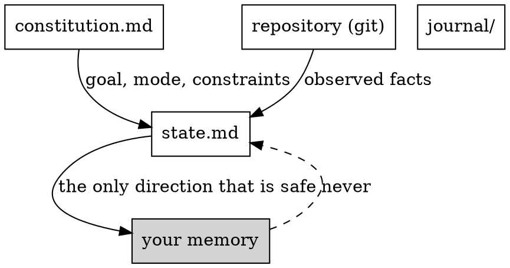

# baton

A run under baton lasts days and survives repeated context compaction. This
skill is the model. `baton-checkpoint` and `baton-resume` are the procedures.

**Announce at start:** "This repository runs under baton — reading state before anything else."

## What is authoritative

| Artifact | Written by | Answers |
|---|---|---|
| `docs/baton/constitution.md` | the human, ratified | what we are doing, who you are, what may not be broken |
| the repository itself | the work | what is actually true |
| `docs/baton/state.md` | you, holding the lock | where we are right now |
| `docs/baton/journal/` | you, append-only | why a decision was made |

Your memory is not on this list. After a compaction it is a summary of a
summary. Everything you believe about progress must be re-derived from the
files and the repository.

## The two logs

The word "append-only" covers two different things here. Keeping them apart
matters when something has to be reconstructed.

| | Event log | Decision log |
|---|---|---|
| Where | `git log -p docs/baton/state.md` | `docs/baton/journal/` |
| Answers | where we were at every moment | why we chose what we chose |
| Complete | yes, nothing is filtered | no, filtered by significance |
| Rebuilds state | yes | no, and it is not meant to |

State is recoverable because every checkpoint is a commit. That is why a
checkpoint that changes nothing writes nothing: a file left dirty in the
working tree is state living outside the log.

## Divergence policy

When state and repository disagree, what you do depends on which kind of field
diverged.

- **Observed fields** — `observed_sha`, `observed_branch`, `tree_clean`. Fix
  them silently. They describe the repository, and the repository is right.
- **Claimed fields** — a wave marked `done`, a gate marked `pass`. Never fix
  these. Set `suspect: true`, describe the divergence in the `Suspect` line,
  and surface it. Silently correcting a claim destroys the evidence that
  something went wrong.

## Decisions worth journaling

Write an entry only if at least one holds:

- the decision is hard to reverse;
- it touches something outside the declared scope of the current wave;
- it reinterprets a rule from the constitution;
- the choice was between real alternatives and the loser was plausible.

Everything else goes unwritten. A journal nobody reads is its own failure
mode, and volume is what makes it unreadable.

Entries are immutable. Superseding a decision means writing a new entry and
marking the old one `superseded-by`, never editing it. The truth is the chain.

## New input mid-run

The constitution is ratified by the human and you do not write it. When new
input arrives that changes the picture, record it as a journal entry of type
`incoming` with `needs_review: true`. If it contradicts the constitution, move
the affected wave to `blocked`, set `needs_human: true`, and surface it. The
amendment itself is the human's to make.

## Red Flags

These thoughts mean stop — you are rationalising.

| Thought | Reality |
|---|---|
| "I remember finishing that wave" | Your memory did not survive the compaction. Read state.md. |
| "The state file is probably stale, I'll just work" | Then fix it first. Stale state is worse than none. |
| "This isn't implemented, I'll write it" | Search first. Not finding it by the name you expected is the documented way agents overwrite working code. |
| "I'll fix the wave status to match reality" | Only for observed fields. A claimed field that diverged is evidence, not a typo. |
| "Checkpointing now would interrupt my flow" | The flow ends at the next compaction either way. |
| "This decision is too small to journal" | Check it against the four criteria rather than against your sense of size. |
| "I'll update the constitution to match what we learned" | You do not write the constitution. Record an `incoming` entry. |
| "The exit criterion is unrealistic, I'll read it loosely" | A criterion read loosely is a gate not run. Escalate instead. |
| "The constitution still says draft, but the intent is clear" | An unratified constitution is a guess about what the human wants. Stop and ask for ratification. |

## Related skills

- **baton-checkpoint** — persist before compaction or at the end of a stretch
- **baton-resume** — recover after a context reset
- **superpowers:brainstorming** — writes the per-wave spec
- **superpowers:writing-plans** — writes the per-wave plan
- **superpowers:subagent-driven-development** — executes the wave
